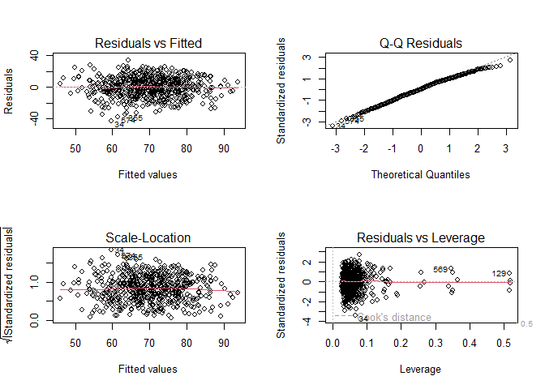
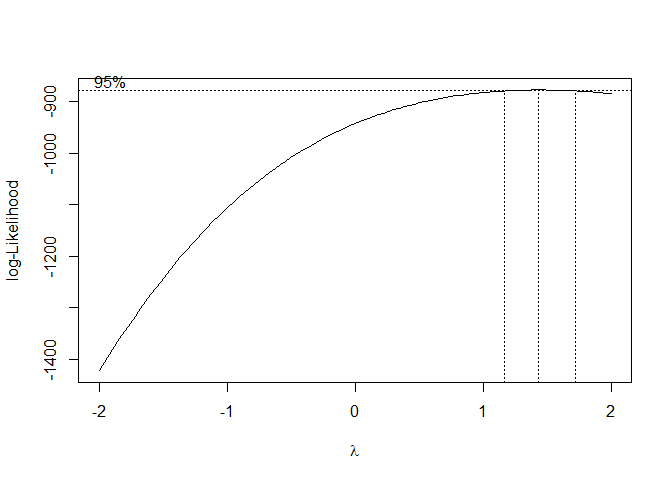
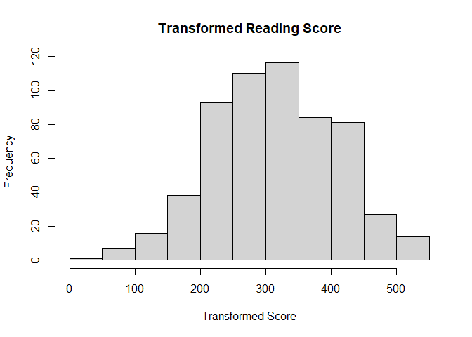
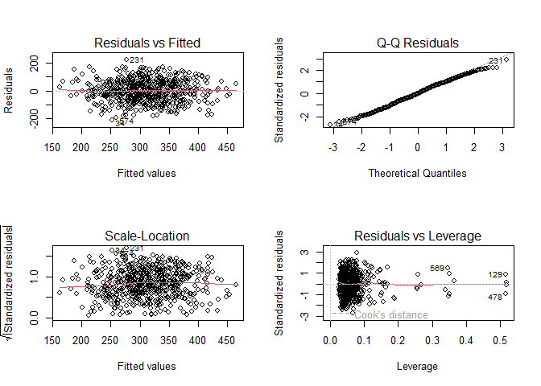

P8130_Final_Reading
================
Yujing FU
2024-12-18

``` r
library(tidyverse)
library(dplyr)
library(ggplot2)
library(caret)
```

    ## Warning: package 'caret' was built under R version 4.4.2

``` r
# import dataset (whole data)
school <- read.csv("Project_1_data.csv", na = c("NA", ",", "")) |>
  janitor::clean_names() |>
  drop_na()

# dataset for math score
math <- school |>
  select(-reading_score, -writing_score)

# dataset for reading score
reading <- school |>
  select(-math_score, -writing_score)

# dataset for writing score
writing <- school |>
  select(-math_score, -reading_score)
```

``` r
# whole school dataset transformed to indicator 0, 1, 2, 3, ...
school_transformed <- school |>
  mutate(across(everything(), as.factor)) |>
  mutate(across(where(is.factor), ~ as.integer(as.factor(.x)) - 1))

# whole school dataset transformed to indicator only containing 0 and 1
indicator_school <- as.data.frame(model.matrix(~ . - 1, data = school))

# math score indicator dataset
indicator_math <- indicator_school |>
  select(-reading_score, -writing_score)

# reading score indicator dataset
indicator_reading <- indicator_school |>
  select(-math_score, -writing_score)

# writing score indicator dataset
indicator_writing <- indicator_school |>
  select(-math_score, -reading_score)
```

``` r
# model for reading_score
excluded_vars <- c("writing_score", "math_score")
predictors <- school[, !names(school) %in% excluded_vars]

# Define the response variable and the predictors
response <- school$reading_score
predictors <- predictors[, !names(predictors) %in% "reading_score"]

# Generate a formula with interaction terms for all pairwise combinations of predictors
predictor_names <- colnames(predictors)
interaction_terms <- paste(predictor_names, collapse = " + ")
formula <- as.formula(paste("reading_score ~ (", interaction_terms, ")^2"))

# Fit the linear regression model
model <- lm(formula, data = school)
summary(model)
```

    ## 
    ## Call:
    ## lm(formula = formula, data = school)
    ## 
    ## Residuals:
    ##     Min      1Q  Median      3Q     Max 
    ## -35.313  -6.516   0.000   7.136  27.200 
    ## 
    ## Coefficients: (5 not defined because of singularities)
    ##                                                             Estimate Std. Error
    ## (Intercept)                                                86.652810  21.558345
    ## gendermale                                                 -7.464415   9.948112
    ## ethnic_groupgroup B                                       -20.165316  17.839659
    ## ethnic_groupgroup C                                       -24.865500  17.213787
    ## ethnic_groupgroup D                                        -8.119202  18.443186
    ## ethnic_groupgroup E                                       -19.637836  17.828087
    ## parent_educbachelor's degree                               36.927746  16.190027
    ## parent_educhigh school                                      7.674809  14.322498
    ## parent_educmaster's degree                                -28.654622  21.820483
    ## parent_educsome college                                    -9.092810  13.463286
    ## parent_educsome high school                                -6.061721  13.149506
    ## lunch_typestandard                                         -0.120103   9.648099
    ## test_prepnone                                             -20.194607   9.996412
    ## parent_marital_statusmarried                               15.264846  13.018108
    ## parent_marital_statussingle                                 6.637086  15.668157
    ## parent_marital_statuswidowed                               19.284030  31.270808
    ## practice_sportregularly                                   -22.079112  16.071970
    ## practice_sportsometimes                                   -20.144529  16.021095
    ## is_first_childyes                                          12.039079  10.360338
    ## nr_siblings                                                -1.485603   3.103648
    ## transport_meansschool_bus                                  -6.316090   9.698686
    ## wkly_study_hours> 10                                      -23.221610  14.948241
    ## wkly_study_hours10-May                                     -0.134981  12.036225
    ## gendermale:ethnic_groupgroup B                              6.927466   6.276622
    ## gendermale:ethnic_groupgroup C                             10.909986   6.058401
    ## gendermale:ethnic_groupgroup D                              6.638805   6.100452
    ## gendermale:ethnic_groupgroup E                              7.879321   6.528749
    ## gendermale:parent_educbachelor's degree                    -5.900737   4.842756
    ## gendermale:parent_educhigh school                          -0.669537   3.902967
    ## gendermale:parent_educmaster's degree                       5.838804   6.714185
    ## gendermale:parent_educsome college                         -6.266605   4.151242
    ## gendermale:parent_educsome high school                     -1.209631   4.091513
    ## gendermale:lunch_typestandard                              -0.914987   2.857661
    ## gendermale:test_prepnone                                    0.069844   2.794666
    ## gendermale:parent_marital_statusmarried                     0.570748   4.010685
    ## gendermale:parent_marital_statussingle                     -1.579200   4.504179
    ## gendermale:parent_marital_statuswidowed                    24.035065  26.601226
    ## gendermale:practice_sportregularly                         -5.231810   4.783298
    ## gendermale:practice_sportsometimes                         -4.428890   4.744073
    ## gendermale:is_first_childyes                                3.025512   2.956689
    ## gendermale:nr_siblings                                     -0.937758   0.914982
    ## gendermale:transport_meansschool_bus                       -0.512855   2.711986
    ## gendermale:wkly_study_hours> 10                            -3.389706   4.283764
    ## gendermale:wkly_study_hours10-May                          -1.497070   3.240547
    ## ethnic_groupgroup B:parent_educbachelor's degree           -5.938662  13.454197
    ## ethnic_groupgroup C:parent_educbachelor's degree           -4.269891  13.531989
    ## ethnic_groupgroup D:parent_educbachelor's degree           -7.147201  13.320585
    ## ethnic_groupgroup E:parent_educbachelor's degree          -18.921509  15.626356
    ## ethnic_groupgroup B:parent_educhigh school                -13.903955   8.469331
    ## ethnic_groupgroup C:parent_educhigh school                 -8.155110   8.156363
    ## ethnic_groupgroup D:parent_educhigh school                 -7.285926   8.259263
    ## ethnic_groupgroup E:parent_educhigh school                 -6.303997   9.285221
    ## ethnic_groupgroup B:parent_educmaster's degree             20.760274  15.826166
    ## ethnic_groupgroup C:parent_educmaster's degree              7.870762  14.665463
    ## ethnic_groupgroup D:parent_educmaster's degree             14.089949  14.938060
    ## ethnic_groupgroup E:parent_educmaster's degree             17.076788  15.745628
    ## ethnic_groupgroup B:parent_educsome college                 2.473459   9.425956
    ## ethnic_groupgroup C:parent_educsome college                 7.911024   8.722904
    ## ethnic_groupgroup D:parent_educsome college                 9.968136   9.140701
    ## ethnic_groupgroup E:parent_educsome college                 7.772972   9.173551
    ## ethnic_groupgroup B:parent_educsome high school           -10.995981   8.805772
    ## ethnic_groupgroup C:parent_educsome high school            -3.039602   8.224852
    ## ethnic_groupgroup D:parent_educsome high school            -3.538849   8.318577
    ## ethnic_groupgroup E:parent_educsome high school             6.346320   8.929231
    ## ethnic_groupgroup B:lunch_typestandard                      5.664931   5.987016
    ## ethnic_groupgroup C:lunch_typestandard                     10.280542   5.730665
    ## ethnic_groupgroup D:lunch_typestandard                      9.797965   5.646309
    ## ethnic_groupgroup E:lunch_typestandard                      2.909241   6.601021
    ## ethnic_groupgroup B:test_prepnone                           6.012016   6.366063
    ## ethnic_groupgroup C:test_prepnone                           9.879911   6.002474
    ## ethnic_groupgroup D:test_prepnone                           6.995423   6.108946
    ## ethnic_groupgroup E:test_prepnone                          13.654671   6.498733
    ## ethnic_groupgroup B:parent_marital_statusmarried            9.178195   8.229831
    ## ethnic_groupgroup C:parent_marital_statusmarried            1.371131   7.546311
    ## ethnic_groupgroup D:parent_marital_statusmarried           -9.123507   7.460632
    ## ethnic_groupgroup E:parent_marital_statusmarried            0.685549   8.324082
    ## ethnic_groupgroup B:parent_marital_statussingle            19.212973   9.861025
    ## ethnic_groupgroup C:parent_marital_statussingle             6.430873   9.429374
    ## ethnic_groupgroup D:parent_marital_statussingle             2.105452   9.144914
    ## ethnic_groupgroup E:parent_marital_statussingle            17.495217  10.517920
    ## ethnic_groupgroup B:parent_marital_statuswidowed           23.380298  87.724201
    ## ethnic_groupgroup C:parent_marital_statuswidowed          110.546341 121.512429
    ## ethnic_groupgroup D:parent_marital_statuswidowed          -23.052122  75.943690
    ## ethnic_groupgroup E:parent_marital_statuswidowed                  NA         NA
    ## ethnic_groupgroup B:practice_sportregularly                12.914114  10.980597
    ## ethnic_groupgroup C:practice_sportregularly                11.696265  10.951945
    ## ethnic_groupgroup D:practice_sportregularly                 9.650943  12.107598
    ## ethnic_groupgroup E:practice_sportregularly                12.381975  11.100421
    ## ethnic_groupgroup B:practice_sportsometimes                11.144176  11.853138
    ## ethnic_groupgroup C:practice_sportsometimes                18.491749  11.542535
    ## ethnic_groupgroup D:practice_sportsometimes                 8.470935  12.783531
    ## ethnic_groupgroup E:practice_sportsometimes                10.310523  11.620312
    ## ethnic_groupgroup B:is_first_childyes                       8.285194   6.069061
    ## ethnic_groupgroup C:is_first_childyes                       1.213103   5.716772
    ## ethnic_groupgroup D:is_first_childyes                      -0.270167   5.789398
    ## ethnic_groupgroup E:is_first_childyes                       3.962654   6.666940
    ## ethnic_groupgroup B:nr_siblings                             0.249735   2.095707
    ## ethnic_groupgroup C:nr_siblings                             0.092095   1.979971
    ## ethnic_groupgroup D:nr_siblings                            -0.561439   2.014573
    ## ethnic_groupgroup E:nr_siblings                             3.454391   2.395471
    ## ethnic_groupgroup B:transport_meansschool_bus             -11.210577   6.216383
    ## ethnic_groupgroup C:transport_meansschool_bus             -13.130845   5.704016
    ## ethnic_groupgroup D:transport_meansschool_bus              -5.728041   5.698398
    ## ethnic_groupgroup E:transport_meansschool_bus             -12.137511   6.663472
    ## ethnic_groupgroup B:wkly_study_hours> 10                   -7.147273  10.998717
    ## ethnic_groupgroup C:wkly_study_hours> 10                    0.007762  10.894233
    ## ethnic_groupgroup D:wkly_study_hours> 10                    2.268857  10.732846
    ## ethnic_groupgroup E:wkly_study_hours> 10                   -4.353571  11.900488
    ## ethnic_groupgroup B:wkly_study_hours10-May                 -8.449931   8.740797
    ## ethnic_groupgroup C:wkly_study_hours10-May                 -2.866893   8.572407
    ## ethnic_groupgroup D:wkly_study_hours10-May                 -2.811620   8.705353
    ## ethnic_groupgroup E:wkly_study_hours10-May                 -5.193734   9.417411
    ## parent_educbachelor's degree:lunch_typestandard             3.009013   5.159802
    ## parent_educhigh school:lunch_typestandard                   2.065004   4.200130
    ## parent_educmaster's degree:lunch_typestandard               8.701083   7.978550
    ## parent_educsome college:lunch_typestandard                  4.935216   4.277469
    ## parent_educsome high school:lunch_typestandard              6.582918   4.347811
    ## parent_educbachelor's degree:test_prepnone                 -3.605229   4.833501
    ## parent_educhigh school:test_prepnone                        0.942119   4.640786
    ## parent_educmaster's degree:test_prepnone                    0.828723   8.177518
    ## parent_educsome college:test_prepnone                      -3.758412   4.296819
    ## parent_educsome high school:test_prepnone                   2.170927   4.244366
    ## parent_educbachelor's degree:parent_marital_statusmarried -17.984352   8.558704
    ## parent_educhigh school:parent_marital_statusmarried         5.495708   6.031123
    ## parent_educmaster's degree:parent_marital_statusmarried    -0.899679   9.073871
    ## parent_educsome college:parent_marital_statusmarried       -4.677371   5.988770
    ## parent_educsome high school:parent_marital_statusmarried   -3.558397   5.839393
    ## parent_educbachelor's degree:parent_marital_statussingle  -16.938226   9.106364
    ## parent_educhigh school:parent_marital_statussingle         10.253829   6.634232
    ## parent_educmaster's degree:parent_marital_statussingle     -0.659718   9.502616
    ## parent_educsome college:parent_marital_statussingle        -2.497921   6.660085
    ## parent_educsome high school:parent_marital_statussingle    -0.020679   6.510505
    ## parent_educbachelor's degree:parent_marital_statuswidowed  21.929668  84.211810
    ## parent_educhigh school:parent_marital_statuswidowed        -2.507216  78.356194
    ## parent_educmaster's degree:parent_marital_statuswidowed   -70.346565  45.327351
    ## parent_educsome college:parent_marital_statuswidowed      -53.761748  59.019184
    ## parent_educsome high school:parent_marital_statuswidowed  -13.736670  57.620288
    ## parent_educbachelor's degree:practice_sportregularly       -5.742987   8.829132
    ## parent_educhigh school:practice_sportregularly            -16.222405   7.605694
    ## parent_educmaster's degree:practice_sportregularly          2.124224  11.094977
    ## parent_educsome college:practice_sportregularly            -3.035355   7.881126
    ## parent_educsome high school:practice_sportregularly        -2.220201   7.580298
    ## parent_educbachelor's degree:practice_sportsometimes      -12.859128   8.483797
    ## parent_educhigh school:practice_sportsometimes            -13.121479   7.214292
    ## parent_educmaster's degree:practice_sportsometimes          5.973273   9.291278
    ## parent_educsome college:practice_sportsometimes            -1.672002   7.519775
    ## parent_educsome high school:practice_sportsometimes         2.913390   7.167762
    ## parent_educbachelor's degree:is_first_childyes              4.554067   5.308089
    ## parent_educhigh school:is_first_childyes                    7.256767   4.582552
    ## parent_educmaster's degree:is_first_childyes                6.139178   7.697451
    ## parent_educsome college:is_first_childyes                   8.976229   4.393592
    ## parent_educsome high school:is_first_childyes               3.689051   4.388873
    ## parent_educbachelor's degree:nr_siblings                   -0.476088   1.699747
    ## parent_educhigh school:nr_siblings                          1.012064   1.346170
    ## parent_educmaster's degree:nr_siblings                      0.776705   2.398088
    ## parent_educsome college:nr_siblings                         0.921460   1.488559
    ## parent_educsome high school:nr_siblings                     0.102181   1.452180
    ## parent_educbachelor's degree:transport_meansschool_bus      4.047872   5.398993
    ## parent_educhigh school:transport_meansschool_bus            5.354862   4.340500
    ## parent_educmaster's degree:transport_meansschool_bus        6.402583   6.680822
    ## parent_educsome college:transport_meansschool_bus           5.471397   4.381679
    ## parent_educsome high school:transport_meansschool_bus       6.362679   4.414842
    ## parent_educbachelor's degree:wkly_study_hours> 10          -8.576993   7.658161
    ## parent_educhigh school:wkly_study_hours> 10                -8.892574   6.452183
    ## parent_educmaster's degree:wkly_study_hours> 10            -3.501947  13.840506
    ## parent_educsome college:wkly_study_hours> 10               -5.403789   6.391353
    ## parent_educsome high school:wkly_study_hours> 10           -5.736565   6.546085
    ## parent_educbachelor's degree:wkly_study_hours10-May        -4.131555   5.332589
    ## parent_educhigh school:wkly_study_hours10-May             -12.114081   4.979378
    ## parent_educmaster's degree:wkly_study_hours10-May          -1.299889   7.136270
    ## parent_educsome college:wkly_study_hours10-May             -3.671234   5.054713
    ## parent_educsome high school:wkly_study_hours10-May         -9.389532   5.362561
    ## lunch_typestandard:test_prepnone                           -3.815843   3.138311
    ## lunch_typestandard:parent_marital_statusmarried            -8.354548   4.131306
    ## lunch_typestandard:parent_marital_statussingle             -4.249727   4.772768
    ## lunch_typestandard:parent_marital_statuswidowed            53.032094  73.732150
    ## lunch_typestandard:practice_sportregularly                  7.705744   5.475765
    ## lunch_typestandard:practice_sportsometimes                 10.810066   5.277849
    ## lunch_typestandard:is_first_childyes                       -4.371394   3.179583
    ## lunch_typestandard:nr_siblings                              0.760098   0.969972
    ## lunch_typestandard:transport_meansschool_bus               -3.520897   2.970988
    ## lunch_typestandard:wkly_study_hours> 10                     7.448168   4.417459
    ## lunch_typestandard:wkly_study_hours10-May                  -0.150559   3.334978
    ## test_prepnone:parent_marital_statusmarried                  2.685964   4.270678
    ## test_prepnone:parent_marital_statussingle                  -1.869376   4.917378
    ## test_prepnone:parent_marital_statuswidowed                -55.361814  61.167959
    ## test_prepnone:practice_sportregularly                       4.397545   5.315447
    ## test_prepnone:practice_sportsometimes                       6.695718   5.179240
    ## test_prepnone:is_first_childyes                             1.158471   3.146438
    ## test_prepnone:nr_siblings                                  -0.485647   0.997232
    ## test_prepnone:transport_meansschool_bus                     1.714949   2.899050
    ## test_prepnone:wkly_study_hours> 10                         -3.448651   4.530551
    ## test_prepnone:wkly_study_hours10-May                        2.495949   3.589660
    ## parent_marital_statusmarried:practice_sportregularly        3.906408   6.987011
    ## parent_marital_statussingle:practice_sportregularly        -5.780831   9.034712
    ## parent_marital_statuswidowed:practice_sportregularly      -60.687877  83.189081
    ## parent_marital_statusmarried:practice_sportsometimes        1.066168   6.874596
    ## parent_marital_statussingle:practice_sportsometimes        -4.339879   8.733089
    ## parent_marital_statuswidowed:practice_sportsometimes              NA         NA
    ## parent_marital_statusmarried:is_first_childyes            -16.731923   4.892875
    ## parent_marital_statussingle:is_first_childyes              -8.769447   5.456087
    ## parent_marital_statuswidowed:is_first_childyes             33.182190  40.828009
    ## parent_marital_statusmarried:nr_siblings                   -0.840597   1.461690
    ## parent_marital_statussingle:nr_siblings                    -0.644484   1.646293
    ## parent_marital_statuswidowed:nr_siblings                   -9.150470   9.972519
    ## parent_marital_statusmarried:transport_meansschool_bus      4.412302   4.084008
    ## parent_marital_statussingle:transport_meansschool_bus      -0.563874   4.680753
    ## parent_marital_statuswidowed:transport_meansschool_bus            NA         NA
    ## parent_marital_statusmarried:wkly_study_hours> 10          21.073358   6.460989
    ## parent_marital_statussingle:wkly_study_hours> 10           27.001000   7.161508
    ## parent_marital_statuswidowed:wkly_study_hours> 10                 NA         NA
    ## parent_marital_statusmarried:wkly_study_hours10-May         4.126213   4.755351
    ## parent_marital_statussingle:wkly_study_hours10-May          4.595880   5.249529
    ## parent_marital_statuswidowed:wkly_study_hours10-May               NA         NA
    ## practice_sportregularly:is_first_childyes                  -3.164192   6.127977
    ## practice_sportsometimes:is_first_childyes                  -4.741102   5.946839
    ## practice_sportregularly:nr_siblings                        -0.616213   1.821947
    ## practice_sportsometimes:nr_siblings                         0.557541   1.750316
    ## practice_sportregularly:transport_meansschool_bus          10.319065   5.037510
    ## practice_sportsometimes:transport_meansschool_bus           6.701725   4.892931
    ## practice_sportregularly:wkly_study_hours> 10                5.499385   7.268664
    ## practice_sportsometimes:wkly_study_hours> 10                3.812137   7.161778
    ## practice_sportregularly:wkly_study_hours10-May              9.121294   5.785063
    ## practice_sportsometimes:wkly_study_hours10-May              0.814808   5.771786
    ## is_first_childyes:nr_siblings                               0.359903   1.112040
    ## is_first_childyes:transport_meansschool_bus                 0.109605   3.178099
    ## is_first_childyes:wkly_study_hours> 10                      2.433921   4.656647
    ## is_first_childyes:wkly_study_hours10-May                   -1.170608   3.536468
    ## nr_siblings:transport_meansschool_bus                       0.855448   0.962074
    ## nr_siblings:wkly_study_hours> 10                            1.488733   1.543230
    ## nr_siblings:wkly_study_hours10-May                          1.828624   1.116257
    ## transport_meansschool_bus:wkly_study_hours> 10              1.357190   4.462681
    ## transport_meansschool_bus:wkly_study_hours10-May            3.570681   3.237242
    ##                                                           t value Pr(>|t|)    
    ## (Intercept)                                                 4.019 7.11e-05 ***
    ## gendermale                                                 -0.750 0.453545    
    ## ethnic_groupgroup B                                        -1.130 0.259077    
    ## ethnic_groupgroup C                                        -1.445 0.149468    
    ## ethnic_groupgroup D                                        -0.440 0.660037    
    ## ethnic_groupgroup E                                        -1.102 0.271412    
    ## parent_educbachelor's degree                                2.281 0.023140 *  
    ## parent_educhigh school                                      0.536 0.592389    
    ## parent_educmaster's degree                                 -1.313 0.189955    
    ## parent_educsome college                                    -0.675 0.499870    
    ## parent_educsome high school                                -0.461 0.645089    
    ## lunch_typestandard                                         -0.012 0.990075    
    ## test_prepnone                                              -2.020 0.044106 *  
    ## parent_marital_statusmarried                                1.173 0.241740    
    ## parent_marital_statussingle                                 0.424 0.672109    
    ## parent_marital_statuswidowed                                0.617 0.537838    
    ## practice_sportregularly                                    -1.374 0.170372    
    ## practice_sportsometimes                                    -1.257 0.209435    
    ## is_first_childyes                                           1.162 0.245993    
    ## nr_siblings                                                -0.479 0.632470    
    ## transport_meansschool_bus                                  -0.651 0.515314    
    ## wkly_study_hours> 10                                       -1.553 0.121193    
    ## wkly_study_hours10-May                                     -0.011 0.991058    
    ## gendermale:ethnic_groupgroup B                              1.104 0.270465    
    ## gendermale:ethnic_groupgroup C                              1.801 0.072573 .  
    ## gendermale:ethnic_groupgroup D                              1.088 0.277216    
    ## gendermale:ethnic_groupgroup E                              1.207 0.228279    
    ## gendermale:parent_educbachelor's degree                    -1.218 0.223847    
    ## gendermale:parent_educhigh school                          -0.172 0.863891    
    ## gendermale:parent_educmaster's degree                       0.870 0.385088    
    ## gendermale:parent_educsome college                         -1.510 0.132032    
    ## gendermale:parent_educsome high school                     -0.296 0.767673    
    ## gendermale:lunch_typestandard                              -0.320 0.749013    
    ## gendermale:test_prepnone                                    0.025 0.980075    
    ## gendermale:parent_marital_statusmarried                     0.142 0.886917    
    ## gendermale:parent_marital_statussingle                     -0.351 0.726088    
    ## gendermale:parent_marital_statuswidowed                     0.904 0.366849    
    ## gendermale:practice_sportregularly                         -1.094 0.274791    
    ## gendermale:practice_sportsometimes                         -0.934 0.351157    
    ## gendermale:is_first_childyes                                1.023 0.306866    
    ## gendermale:nr_siblings                                     -1.025 0.306104    
    ## gendermale:transport_meansschool_bus                       -0.189 0.850116    
    ## gendermale:wkly_study_hours> 10                            -0.791 0.429296    
    ## gendermale:wkly_study_hours10-May                          -0.462 0.644375    
    ## ethnic_groupgroup B:parent_educbachelor's degree           -0.441 0.659190    
    ## ethnic_groupgroup C:parent_educbachelor's degree           -0.316 0.752535    
    ## ethnic_groupgroup D:parent_educbachelor's degree           -0.537 0.591909    
    ## ethnic_groupgroup E:parent_educbachelor's degree           -1.211 0.226741    
    ## ethnic_groupgroup B:parent_educhigh school                 -1.642 0.101531    
    ## ethnic_groupgroup C:parent_educhigh school                 -1.000 0.318058    
    ## ethnic_groupgroup D:parent_educhigh school                 -0.882 0.378285    
    ## ethnic_groupgroup E:parent_educhigh school                 -0.679 0.497621    
    ## ethnic_groupgroup B:parent_educmaster's degree              1.312 0.190436    
    ## ethnic_groupgroup C:parent_educmaster's degree              0.537 0.591816    
    ## ethnic_groupgroup D:parent_educmaster's degree              0.943 0.346200    
    ## ethnic_groupgroup E:parent_educmaster's degree              1.085 0.278853    
    ## ethnic_groupgroup B:parent_educsome college                 0.262 0.793156    
    ## ethnic_groupgroup C:parent_educsome college                 0.907 0.365055    
    ## ethnic_groupgroup D:parent_educsome college                 1.091 0.276215    
    ## ethnic_groupgroup E:parent_educsome college                 0.847 0.397379    
    ## ethnic_groupgroup B:parent_educsome high school            -1.249 0.212580    
    ## ethnic_groupgroup C:parent_educsome high school            -0.370 0.711926    
    ## ethnic_groupgroup D:parent_educsome high school            -0.425 0.670789    
    ## ethnic_groupgroup E:parent_educsome high school             0.711 0.477710    
    ## ethnic_groupgroup B:lunch_typestandard                      0.946 0.344682    
    ## ethnic_groupgroup C:lunch_typestandard                      1.794 0.073662 .  
    ## ethnic_groupgroup D:lunch_typestandard                      1.735 0.083548 .  
    ## ethnic_groupgroup E:lunch_typestandard                      0.441 0.659677    
    ## ethnic_groupgroup B:test_prepnone                           0.944 0.345608    
    ## ethnic_groupgroup C:test_prepnone                           1.646 0.100644    
    ## ethnic_groupgroup D:test_prepnone                           1.145 0.252926    
    ## ethnic_groupgroup E:test_prepnone                           2.101 0.036326 *  
    ## ethnic_groupgroup B:parent_marital_statusmarried            1.115 0.265496    
    ## ethnic_groupgroup C:parent_marital_statusmarried            0.182 0.855924    
    ## ethnic_groupgroup D:parent_marital_statusmarried           -1.223 0.222175    
    ## ethnic_groupgroup E:parent_marital_statusmarried            0.082 0.934409    
    ## ethnic_groupgroup B:parent_marital_statussingle             1.948 0.052149 .  
    ## ethnic_groupgroup C:parent_marital_statussingle             0.682 0.495676    
    ## ethnic_groupgroup D:parent_marital_statussingle             0.230 0.818043    
    ## ethnic_groupgroup E:parent_marital_statussingle             1.663 0.097111 .  
    ## ethnic_groupgroup B:parent_marital_statuswidowed            0.267 0.789991    
    ## ethnic_groupgroup C:parent_marital_statuswidowed            0.910 0.363563    
    ## ethnic_groupgroup D:parent_marital_statuswidowed           -0.304 0.761652    
    ## ethnic_groupgroup E:parent_marital_statuswidowed               NA       NA    
    ## ethnic_groupgroup B:practice_sportregularly                 1.176 0.240340    
    ## ethnic_groupgroup C:practice_sportregularly                 1.068 0.286255    
    ## ethnic_groupgroup D:practice_sportregularly                 0.797 0.425921    
    ## ethnic_groupgroup E:practice_sportregularly                 1.115 0.265403    
    ## ethnic_groupgroup B:practice_sportsometimes                 0.940 0.347753    
    ## ethnic_groupgroup C:practice_sportsometimes                 1.602 0.110023    
    ## ethnic_groupgroup D:practice_sportsometimes                 0.663 0.507984    
    ## ethnic_groupgroup E:practice_sportsometimes                 0.887 0.375520    
    ## ethnic_groupgroup B:is_first_childyes                       1.365 0.173060    
    ## ethnic_groupgroup C:is_first_childyes                       0.212 0.832071    
    ## ethnic_groupgroup D:is_first_childyes                      -0.047 0.962806    
    ## ethnic_groupgroup E:is_first_childyes                       0.594 0.552637    
    ## ethnic_groupgroup B:nr_siblings                             0.119 0.905211    
    ## ethnic_groupgroup C:nr_siblings                             0.047 0.962927    
    ## ethnic_groupgroup D:nr_siblings                            -0.279 0.780644    
    ## ethnic_groupgroup E:nr_siblings                             1.442 0.150160    
    ## ethnic_groupgroup B:transport_meansschool_bus              -1.803 0.072165 .  
    ## ethnic_groupgroup C:transport_meansschool_bus              -2.302 0.021905 *  
    ## ethnic_groupgroup D:transport_meansschool_bus              -1.005 0.315477    
    ## ethnic_groupgroup E:transport_meansschool_bus              -1.821 0.069363 .  
    ## ethnic_groupgroup B:wkly_study_hours> 10                   -0.650 0.516219    
    ## ethnic_groupgroup C:wkly_study_hours> 10                    0.001 0.999432    
    ## ethnic_groupgroup D:wkly_study_hours> 10                    0.211 0.832700    
    ## ethnic_groupgroup E:wkly_study_hours> 10                   -0.366 0.714706    
    ## ethnic_groupgroup B:wkly_study_hours10-May                 -0.967 0.334333    
    ## ethnic_groupgroup C:wkly_study_hours10-May                 -0.334 0.738248    
    ## ethnic_groupgroup D:wkly_study_hours10-May                 -0.323 0.746901    
    ## ethnic_groupgroup E:wkly_study_hours10-May                 -0.552 0.581632    
    ## parent_educbachelor's degree:lunch_typestandard             0.583 0.560149    
    ## parent_educhigh school:lunch_typestandard                   0.492 0.623265    
    ## parent_educmaster's degree:lunch_typestandard               1.091 0.276198    
    ## parent_educsome college:lunch_typestandard                  1.154 0.249362    
    ## parent_educsome high school:lunch_typestandard              1.514 0.130886    
    ## parent_educbachelor's degree:test_prepnone                 -0.746 0.456226    
    ## parent_educhigh school:test_prepnone                        0.203 0.839243    
    ## parent_educmaster's degree:test_prepnone                    0.101 0.919336    
    ## parent_educsome college:test_prepnone                      -0.875 0.382324    
    ## parent_educsome high school:test_prepnone                   0.511 0.609326    
    ## parent_educbachelor's degree:parent_marital_statusmarried  -2.101 0.036312 *  
    ## parent_educhigh school:parent_marital_statusmarried         0.911 0.362788    
    ## parent_educmaster's degree:parent_marital_statusmarried    -0.099 0.921074    
    ## parent_educsome college:parent_marital_statusmarried       -0.781 0.435303    
    ## parent_educsome high school:parent_marital_statusmarried   -0.609 0.542659    
    ## parent_educbachelor's degree:parent_marital_statussingle   -1.860 0.063697 .  
    ## parent_educhigh school:parent_marital_statussingle          1.546 0.123084    
    ## parent_educmaster's degree:parent_marital_statussingle     -0.069 0.944690    
    ## parent_educsome college:parent_marital_statussingle        -0.375 0.707838    
    ## parent_educsome high school:parent_marital_statussingle    -0.003 0.997468    
    ## parent_educbachelor's degree:parent_marital_statuswidowed   0.260 0.794696    
    ## parent_educhigh school:parent_marital_statuswidowed        -0.032 0.974492    
    ## parent_educmaster's degree:parent_marital_statuswidowed    -1.552 0.121551    
    ## parent_educsome college:parent_marital_statuswidowed       -0.911 0.362949    
    ## parent_educsome high school:parent_marital_statuswidowed   -0.238 0.811707    
    ## parent_educbachelor's degree:practice_sportregularly       -0.650 0.515812    
    ## parent_educhigh school:practice_sportregularly             -2.133 0.033608 *  
    ## parent_educmaster's degree:practice_sportregularly          0.191 0.848275    
    ## parent_educsome college:practice_sportregularly            -0.385 0.700360    
    ## parent_educsome high school:practice_sportregularly        -0.293 0.769775    
    ## parent_educbachelor's degree:practice_sportsometimes       -1.516 0.130468    
    ## parent_educhigh school:practice_sportsometimes             -1.819 0.069772 .  
    ## parent_educmaster's degree:practice_sportsometimes          0.643 0.520706    
    ## parent_educsome college:practice_sportsometimes            -0.222 0.824170    
    ## parent_educsome high school:practice_sportsometimes         0.406 0.684649    
    ## parent_educbachelor's degree:is_first_childyes              0.858 0.391493    
    ## parent_educhigh school:is_first_childyes                    1.584 0.114173    
    ## parent_educmaster's degree:is_first_childyes                0.798 0.425653    
    ## parent_educsome college:is_first_childyes                   2.043 0.041780 *  
    ## parent_educsome high school:is_first_childyes               0.841 0.401162    
    ## parent_educbachelor's degree:nr_siblings                   -0.280 0.779567    
    ## parent_educhigh school:nr_siblings                          0.752 0.452658    
    ## parent_educmaster's degree:nr_siblings                      0.324 0.746214    
    ## parent_educsome college:nr_siblings                         0.619 0.536291    
    ## parent_educsome high school:nr_siblings                     0.070 0.943943    
    ## parent_educbachelor's degree:transport_meansschool_bus      0.750 0.453899    
    ## parent_educhigh school:transport_meansschool_bus            1.234 0.218123    
    ## parent_educmaster's degree:transport_meansschool_bus        0.958 0.338530    
    ## parent_educsome college:transport_meansschool_bus           1.249 0.212589    
    ## parent_educsome high school:transport_meansschool_bus       1.441 0.150399    
    ## parent_educbachelor's degree:wkly_study_hours> 10          -1.120 0.263471    
    ## parent_educhigh school:wkly_study_hours> 10                -1.378 0.168991    
    ## parent_educmaster's degree:wkly_study_hours> 10            -0.253 0.800396    
    ## parent_educsome college:wkly_study_hours> 10               -0.845 0.398404    
    ## parent_educsome high school:wkly_study_hours> 10           -0.876 0.381434    
    ## parent_educbachelor's degree:wkly_study_hours10-May        -0.775 0.438983    
    ## parent_educhigh school:wkly_study_hours10-May              -2.433 0.015468 *  
    ## parent_educmaster's degree:wkly_study_hours10-May          -0.182 0.855566    
    ## parent_educsome college:wkly_study_hours10-May             -0.726 0.468129    
    ## parent_educsome high school:wkly_study_hours10-May         -1.751 0.080810 .  
    ## lunch_typestandard:test_prepnone                           -1.216 0.224825    
    ## lunch_typestandard:parent_marital_statusmarried            -2.022 0.043891 *  
    ## lunch_typestandard:parent_marital_statussingle             -0.890 0.373841    
    ## lunch_typestandard:parent_marital_statuswidowed             0.719 0.472453    
    ## lunch_typestandard:practice_sportregularly                  1.407 0.160220    
    ## lunch_typestandard:practice_sportsometimes                  2.048 0.041268 *  
    ## lunch_typestandard:is_first_childyes                       -1.375 0.170041    
    ## lunch_typestandard:nr_siblings                              0.784 0.433775    
    ## lunch_typestandard:transport_meansschool_bus               -1.185 0.236765    
    ## lunch_typestandard:wkly_study_hours> 10                     1.686 0.092650 .  
    ## lunch_typestandard:wkly_study_hours10-May                  -0.045 0.964017    
    ## test_prepnone:parent_marital_statusmarried                  0.629 0.529794    
    ## test_prepnone:parent_marital_statussingle                  -0.380 0.704054    
    ## test_prepnone:parent_marital_statuswidowed                 -0.905 0.366031    
    ## test_prepnone:practice_sportregularly                       0.827 0.408608    
    ## test_prepnone:practice_sportsometimes                       1.293 0.196912    
    ## test_prepnone:is_first_childyes                             0.368 0.712952    
    ## test_prepnone:nr_siblings                                  -0.487 0.626559    
    ## test_prepnone:transport_meansschool_bus                     0.592 0.554521    
    ## test_prepnone:wkly_study_hours> 10                         -0.761 0.447038    
    ## test_prepnone:wkly_study_hours10-May                        0.695 0.487307    
    ## parent_marital_statusmarried:practice_sportregularly        0.559 0.576445    
    ## parent_marital_statussingle:practice_sportregularly        -0.640 0.522680    
    ## parent_marital_statuswidowed:practice_sportregularly       -0.730 0.466161    
    ## parent_marital_statusmarried:practice_sportsometimes        0.155 0.876839    
    ## parent_marital_statussingle:practice_sportsometimes        -0.497 0.619531    
    ## parent_marital_statuswidowed:practice_sportsometimes           NA       NA    
    ## parent_marital_statusmarried:is_first_childyes             -3.420 0.000699 ***
    ## parent_marital_statussingle:is_first_childyes              -1.607 0.108873    
    ## parent_marital_statuswidowed:is_first_childyes              0.813 0.416911    
    ## parent_marital_statusmarried:nr_siblings                   -0.575 0.565594    
    ## parent_marital_statussingle:nr_siblings                    -0.391 0.695678    
    ## parent_marital_statuswidowed:nr_siblings                   -0.918 0.359461    
    ## parent_marital_statusmarried:transport_meansschool_bus      1.080 0.280696    
    ## parent_marital_statussingle:transport_meansschool_bus      -0.120 0.904181    
    ## parent_marital_statuswidowed:transport_meansschool_bus         NA       NA    
    ## parent_marital_statusmarried:wkly_study_hours> 10           3.262 0.001214 ** 
    ## parent_marital_statussingle:wkly_study_hours> 10            3.770 0.000191 ***
    ## parent_marital_statuswidowed:wkly_study_hours> 10              NA       NA    
    ## parent_marital_statusmarried:wkly_study_hours10-May         0.868 0.386139    
    ## parent_marital_statussingle:wkly_study_hours10-May          0.875 0.381896    
    ## parent_marital_statuswidowed:wkly_study_hours10-May            NA       NA    
    ## practice_sportregularly:is_first_childyes                  -0.516 0.605927    
    ## practice_sportsometimes:is_first_childyes                  -0.797 0.425834    
    ## practice_sportregularly:nr_siblings                        -0.338 0.735398    
    ## practice_sportsometimes:nr_siblings                         0.319 0.750263    
    ## practice_sportregularly:transport_meansschool_bus           2.048 0.041243 *  
    ## practice_sportsometimes:transport_meansschool_bus           1.370 0.171644    
    ## practice_sportregularly:wkly_study_hours> 10                0.757 0.449793    
    ## practice_sportsometimes:wkly_study_hours> 10                0.532 0.594855    
    ## practice_sportregularly:wkly_study_hours10-May              1.577 0.115746    
    ## practice_sportsometimes:wkly_study_hours10-May              0.141 0.887814    
    ## is_first_childyes:nr_siblings                               0.324 0.746398    
    ## is_first_childyes:transport_meansschool_bus                 0.034 0.972508    
    ## is_first_childyes:wkly_study_hours> 10                      0.523 0.601522    
    ## is_first_childyes:wkly_study_hours10-May                   -0.331 0.740830    
    ## nr_siblings:transport_meansschool_bus                       0.889 0.374507    
    ## nr_siblings:wkly_study_hours> 10                            0.965 0.335351    
    ## nr_siblings:wkly_study_hours10-May                          1.638 0.102261    
    ## transport_meansschool_bus:wkly_study_hours> 10              0.304 0.761213    
    ## transport_meansschool_bus:wkly_study_hours10-May            1.103 0.270766    
    ## ---
    ## Signif. codes:  0 '***' 0.001 '**' 0.01 '*' 0.05 '.' 0.1 ' ' 1
    ## 
    ## Residual standard error: 12.97 on 359 degrees of freedom
    ## Multiple R-squared:  0.552,  Adjusted R-squared:  0.2687 
    ## F-statistic: 1.949 on 227 and 359 DF,  p-value: 7.697e-09

From this overall linear regression model, we notice there are some
significant covariates such as ??

``` r
lm(reading_score ~ . + parent_educ*parent_marital_status+ lunch_type*practice_sport
, data = reading) |>
  summary()
```

    ## 
    ## Call:
    ## lm(formula = reading_score ~ . + parent_educ * parent_marital_status + 
    ##     lunch_type * practice_sport, data = reading)
    ## 
    ## Residuals:
    ##     Min      1Q  Median      3Q     Max 
    ## -42.645  -7.915   0.419   9.545  33.778 
    ## 
    ## Coefficients:
    ##                                                             Estimate Std. Error
    ## (Intercept)                                                65.083284   4.971320
    ## gendermale                                                 -8.093858   1.116842
    ## ethnic_groupgroup B                                        -1.114683   2.249740
    ## ethnic_groupgroup C                                        -0.908706   2.150555
    ## ethnic_groupgroup D                                         2.783705   2.167082
    ## ethnic_groupgroup E                                         6.597167   2.402256
    ## parent_educbachelor's degree                               16.978025   5.914052
    ## parent_educhigh school                                     -4.220183   4.257294
    ## parent_educmaster's degree                                  4.830356   5.611951
    ## parent_educsome college                                     5.172194   4.392453
    ## parent_educsome high school                                -0.334357   4.275718
    ## lunch_typestandard                                          2.774570   3.553310
    ## test_prepnone                                              -6.471913   1.174184
    ## parent_marital_statusmarried                                9.639576   3.459287
    ## parent_marital_statussingle                                 6.028293   3.864312
    ## parent_marital_statuswidowed                               16.142847   9.896958
    ## practice_sportregularly                                    -3.033537   3.289981
    ## practice_sportsometimes                                    -4.905908   3.211098
    ## is_first_childyes                                           1.631817   1.193162
    ## nr_siblings                                                 0.464456   0.375565
    ## transport_meansschool_bus                                   0.282928   1.138163
    ## wkly_study_hours> 10                                        0.673086   1.710048
    ## wkly_study_hours10-May                                      2.584747   1.310309
    ## parent_educbachelor's degree:parent_marital_statusmarried -15.175133   6.416886
    ## parent_educhigh school:parent_marital_statusmarried        -1.280712   4.775239
    ## parent_educmaster's degree:parent_marital_statusmarried    -1.462062   6.540053
    ## parent_educsome college:parent_marital_statusmarried       -8.577035   4.895673
    ## parent_educsome high school:parent_marital_statusmarried   -5.420106   4.870724
    ## parent_educbachelor's degree:parent_marital_statussingle  -18.766800   7.275593
    ## parent_educhigh school:parent_marital_statussingle          2.687206   5.501899
    ## parent_educmaster's degree:parent_marital_statussingle      1.302531   7.244299
    ## parent_educsome college:parent_marital_statussingle       -10.637148   5.627254
    ## parent_educsome high school:parent_marital_statussingle    -4.698909   5.443146
    ## parent_educbachelor's degree:parent_marital_statuswidowed -16.657798  13.483737
    ## parent_educhigh school:parent_marital_statuswidowed       -20.890599  12.255214
    ## parent_educmaster's degree:parent_marital_statuswidowed   -17.224693  17.114538
    ## parent_educsome college:parent_marital_statuswidowed        0.004055  12.875880
    ## parent_educsome high school:parent_marital_statuswidowed   -4.827763  13.951872
    ## lunch_typestandard:practice_sportregularly                  4.228555   4.034358
    ## lunch_typestandard:practice_sportsometimes                  8.640834   3.924819
    ##                                                           t value Pr(>|t|)    
    ## (Intercept)                                                13.092  < 2e-16 ***
    ## gendermale                                                 -7.247 1.46e-12 ***
    ## ethnic_groupgroup B                                        -0.495  0.62047    
    ## ethnic_groupgroup C                                        -0.423  0.67279    
    ## ethnic_groupgroup D                                         1.285  0.19950    
    ## ethnic_groupgroup E                                         2.746  0.00623 ** 
    ## parent_educbachelor's degree                                2.871  0.00425 ** 
    ## parent_educhigh school                                     -0.991  0.32199    
    ## parent_educmaster's degree                                  0.861  0.38977    
    ## parent_educsome college                                     1.178  0.23950    
    ## parent_educsome high school                                -0.078  0.93770    
    ## lunch_typestandard                                          0.781  0.43523    
    ## test_prepnone                                              -5.512 5.48e-08 ***
    ## parent_marital_statusmarried                                2.787  0.00551 ** 
    ## parent_marital_statussingle                                 1.560  0.11934    
    ## parent_marital_statuswidowed                                1.631  0.10345    
    ## practice_sportregularly                                    -0.922  0.35691    
    ## practice_sportsometimes                                    -1.528  0.12714    
    ## is_first_childyes                                           1.368  0.17199    
    ## nr_siblings                                                 1.237  0.21673    
    ## transport_meansschool_bus                                   0.249  0.80378    
    ## wkly_study_hours> 10                                        0.394  0.69402    
    ## wkly_study_hours10-May                                      1.973  0.04904 *  
    ## parent_educbachelor's degree:parent_marital_statusmarried  -2.365  0.01838 *  
    ## parent_educhigh school:parent_marital_statusmarried        -0.268  0.78865    
    ## parent_educmaster's degree:parent_marital_statusmarried    -0.224  0.82319    
    ## parent_educsome college:parent_marital_statusmarried       -1.752  0.08034 .  
    ## parent_educsome high school:parent_marital_statusmarried   -1.113  0.26629    
    ## parent_educbachelor's degree:parent_marital_statussingle   -2.579  0.01016 *  
    ## parent_educhigh school:parent_marital_statussingle          0.488  0.62545    
    ## parent_educmaster's degree:parent_marital_statussingle      0.180  0.85738    
    ## parent_educsome college:parent_marital_statussingle        -1.890  0.05925 .  
    ## parent_educsome high school:parent_marital_statussingle    -0.863  0.38837    
    ## parent_educbachelor's degree:parent_marital_statuswidowed  -1.235  0.21721    
    ## parent_educhigh school:parent_marital_statuswidowed        -1.705  0.08883 .  
    ## parent_educmaster's degree:parent_marital_statuswidowed    -1.006  0.31465    
    ## parent_educsome college:parent_marital_statuswidowed        0.000  0.99975    
    ## parent_educsome high school:parent_marital_statuswidowed   -0.346  0.72945    
    ## lunch_typestandard:practice_sportregularly                  1.048  0.29504    
    ## lunch_typestandard:practice_sportsometimes                  2.202  0.02811 *  
    ## ---
    ## Signif. codes:  0 '***' 0.001 '**' 0.01 '*' 0.05 '.' 0.1 ' ' 1
    ## 
    ## Residual standard error: 13.07 on 547 degrees of freedom
    ## Multiple R-squared:  0.307,  Adjusted R-squared:  0.2576 
    ## F-statistic: 6.212 on 39 and 547 DF,  p-value: < 2.2e-16

``` r
set.seed(1111)
model1 <- lm(reading_score ~ ., data = reading)

model2 <- lm(reading_score ~ . + parent_educ*parent_marital_status + lunch_type*practice_sport, data = reading)

anova_results <- anova(model1, model2)

print(anova_results)
```

    ## Analysis of Variance Table
    ## 
    ## Model 1: reading_score ~ gender + ethnic_group + parent_educ + lunch_type + 
    ##     test_prep + parent_marital_status + practice_sport + is_first_child + 
    ##     nr_siblings + transport_means + wkly_study_hours
    ## Model 2: reading_score ~ gender + ethnic_group + parent_educ + lunch_type + 
    ##     test_prep + parent_marital_status + practice_sport + is_first_child + 
    ##     nr_siblings + transport_means + wkly_study_hours + parent_educ * 
    ##     parent_marital_status + lunch_type * practice_sport
    ##   Res.Df   RSS Df Sum of Sq     F  Pr(>F)  
    ## 1    564 98275                             
    ## 2    547 93418 17    4857.2 1.673 0.04374 *
    ## ---
    ## Signif. codes:  0 '***' 0.001 '**' 0.01 '*' 0.05 '.' 0.1 ' ' 1

Based on the significance condition of overall regression, we select two
interaction term: `parent_educ*parent_marital_status` and
`lunch_type*practice_sport`. Then we apply ANOVA to test whether adding
the interaction term is better. The ANOVA P value = 0.04374 less than
0.05, indicating that the model with the addition of interaction terms
significantly improves the fitting effect.

``` r
# check the Multicollinearity
library(car)
```

    ## Loading required package: carData

    ## 
    ## Attaching package: 'car'

    ## The following object is masked from 'package:dplyr':
    ## 
    ##     recode

    ## The following object is masked from 'package:purrr':
    ## 
    ##     some

``` r
vif(model2)
```

    ## there are higher-order terms (interactions) in this model
    ## consider setting type = 'predictor'; see ?vif

    ##                                           GVIF Df GVIF^(1/(2*Df))
    ## gender                            1.066059e+00  1        1.032501
    ## ethnic_group                      1.329745e+00  4        1.036266
    ## parent_educ                       1.302521e+04  5        2.579161
    ## lunch_type                        9.884998e+00  1        3.144042
    ## test_prep                         1.084159e+00  1        1.041230
    ## parent_marital_status             1.722301e+02  3        2.358766
    ## practice_sport                    9.893745e+00  2        1.773537
    ## is_first_child                    1.077000e+00  1        1.037786
    ## nr_siblings                       1.062553e+00  1        1.030802
    ## transport_means                   1.059365e+00  1        1.029254
    ## wkly_study_hours                  1.118370e+00  2        1.028363
    ## parent_educ:parent_marital_status 8.480152e+05 15        1.576208
    ## lunch_type:practice_sport         3.577985e+01  2        2.445736

``` r
# all GVIF^(1/(2*Df)) are smaller than 5
```

``` r
library(car)

# 1. Linearity and Homoscedasticity
par(mfrow = c(2, 2))
plot(model2)
```

    ## Warning: not plotting observations with leverage one:
    ##   190

<!-- -->

``` r
# 2. Normality of Residuals
shapiro_test <-
  shapiro.test(residuals(model2))
shapiro_test
```

    ## 
    ##  Shapiro-Wilk normality test
    ## 
    ## data:  residuals(model2)
    ## W = 0.99292, p-value = 0.007084

``` r
# 3. Independence (Durbin-Watson test)
dw_test <- durbinWatsonTest(model2)
dw_test
```

    ##  lag Autocorrelation D-W Statistic p-value
    ##    1      0.02638339      1.940974    0.47
    ##  Alternative hypothesis: rho != 0

``` r
# 4. No Multicollinearity
vif_values <- vif(model2)
```

    ## there are higher-order terms (interactions) in this model
    ## consider setting type = 'predictor'; see ?vif

``` r
vif_values
```

    ##                                           GVIF Df GVIF^(1/(2*Df))
    ## gender                            1.066059e+00  1        1.032501
    ## ethnic_group                      1.329745e+00  4        1.036266
    ## parent_educ                       1.302521e+04  5        2.579161
    ## lunch_type                        9.884998e+00  1        3.144042
    ## test_prep                         1.084159e+00  1        1.041230
    ## parent_marital_status             1.722301e+02  3        2.358766
    ## practice_sport                    9.893745e+00  2        1.773537
    ## is_first_child                    1.077000e+00  1        1.037786
    ## nr_siblings                       1.062553e+00  1        1.030802
    ## transport_means                   1.059365e+00  1        1.029254
    ## wkly_study_hours                  1.118370e+00  2        1.028363
    ## parent_educ:parent_marital_status 8.480152e+05 15        1.576208
    ## lunch_type:practice_sport         3.577985e+01  2        2.445736

``` r
# Box-Cox
library(MASS)
```

    ## 
    ## Attaching package: 'MASS'

    ## The following object is masked from 'package:dplyr':
    ## 
    ##     select

``` r
boxcox_result <- boxcox(model2, lambda = seq(-2, 2, 0.1))
```

<!-- -->

``` r
optimal_lambda <- boxcox_result$x[which.max(boxcox_result$y)]
cat("Optimal Lambda:", optimal_lambda, "\n")
```

    ## Optimal Lambda: 1.434343

``` r
# Transform Y based on the optimal lambda = 1.434343
reading_trans <- reading |>
  mutate(reading_score_trans = (reading_score^optimal_lambda - 1) / optimal_lambda)


# check normality
hist(reading_trans$reading_score_trans, main = "Transformed Reading Score", xlab = "Transformed Score")
```

<!-- -->

``` r
library(dplyr)


# Remove the original `reading_score` column
reading_trans <- 
  reading_trans %>% dplyr::select(-reading_score)

# Fit the transformed model
model3 <- lm(reading_score_trans ~ . + parent_educ * parent_marital_status + lunch_type * practice_sport, data = reading_trans)

# Display the summary of the model
summary(model3) # improve in adjusted R2
```

    ## 
    ## Call:
    ## lm(formula = reading_score_trans ~ . + parent_educ * parent_marital_status + 
    ##     lunch_type * practice_sport, data = reading_trans)
    ## 
    ## Residuals:
    ##      Min       1Q   Median       3Q      Max 
    ## -211.679  -51.968   -0.425   58.368  223.451 
    ## 
    ## Coefficients:
    ##                                                           Estimate Std. Error
    ## (Intercept)                                                283.349     30.805
    ## gendermale                                                 -51.630      6.920
    ## ethnic_groupgroup B                                         -7.560     13.940
    ## ethnic_groupgroup C                                         -6.954     13.326
    ## ethnic_groupgroup D                                         15.984     13.428
    ## ethnic_groupgroup E                                         40.296     14.886
    ## parent_educbachelor's degree                               105.138     36.646
    ## parent_educhigh school                                     -27.726     26.380
    ## parent_educmaster's degree                                  27.854     34.774
    ## parent_educsome college                                     30.355     27.218
    ## parent_educsome high school                                 -1.632     26.494
    ## lunch_typestandard                                          17.720     22.018
    ## test_prepnone                                              -40.315      7.276
    ## parent_marital_statusmarried                                58.587     21.435
    ## parent_marital_statussingle                                 35.198     23.945
    ## parent_marital_statuswidowed                               100.733     61.326
    ## practice_sportregularly                                    -16.361     20.386
    ## practice_sportsometimes                                    -28.375     19.897
    ## is_first_childyes                                            9.420      7.393
    ## nr_siblings                                                  3.022      2.327
    ## transport_meansschool_bus                                    1.402      7.053
    ## wkly_study_hours> 10                                         5.290     10.596
    ## wkly_study_hours10-May                                      16.322      8.119
    ## parent_educbachelor's degree:parent_marital_statusmarried  -93.348     39.762
    ## parent_educhigh school:parent_marital_statusmarried         -7.125     29.590
    ## parent_educmaster's degree:parent_marital_statusmarried     -6.641     40.525
    ## parent_educsome college:parent_marital_statusmarried       -51.638     30.336
    ## parent_educsome high school:parent_marital_statusmarried   -34.363     30.181
    ## parent_educbachelor's degree:parent_marital_statussingle  -113.924     45.083
    ## parent_educhigh school:parent_marital_statussingle          19.573     34.092
    ## parent_educmaster's degree:parent_marital_statussingle      14.222     44.889
    ## parent_educsome college:parent_marital_statussingle        -63.818     34.869
    ## parent_educsome high school:parent_marital_statussingle    -26.908     33.728
    ## parent_educbachelor's degree:parent_marital_statuswidowed -101.618     83.552
    ## parent_educhigh school:parent_marital_statuswidowed       -130.764     75.939
    ## parent_educmaster's degree:parent_marital_statuswidowed   -107.009    106.050
    ## parent_educsome college:parent_marital_statuswidowed         3.782     79.785
    ## parent_educsome high school:parent_marital_statuswidowed   -35.404     86.452
    ## lunch_typestandard:practice_sportregularly                  25.250     24.999
    ## lunch_typestandard:practice_sportsometimes                  52.872     24.320
    ##                                                           t value Pr(>|t|)    
    ## (Intercept)                                                 9.198  < 2e-16 ***
    ## gendermale                                                 -7.460 3.41e-13 ***
    ## ethnic_groupgroup B                                        -0.542  0.58784    
    ## ethnic_groupgroup C                                        -0.522  0.60200    
    ## ethnic_groupgroup D                                         1.190  0.23445    
    ## ethnic_groupgroup E                                         2.707  0.00700 ** 
    ## parent_educbachelor's degree                                2.869  0.00428 ** 
    ## parent_educhigh school                                     -1.051  0.29372    
    ## parent_educmaster's degree                                  0.801  0.42348    
    ## parent_educsome college                                     1.115  0.26522    
    ## parent_educsome high school                                -0.062  0.95090    
    ## lunch_typestandard                                          0.805  0.42128    
    ## test_prepnone                                              -5.541 4.68e-08 ***
    ## parent_marital_statusmarried                                2.733  0.00648 ** 
    ## parent_marital_statussingle                                 1.470  0.14215    
    ## parent_marital_statuswidowed                                1.643  0.10104    
    ## practice_sportregularly                                    -0.803  0.42258    
    ## practice_sportsometimes                                    -1.426  0.15443    
    ## is_first_childyes                                           1.274  0.20317    
    ## nr_siblings                                                 1.299  0.19460    
    ## transport_meansschool_bus                                   0.199  0.84249    
    ## wkly_study_hours> 10                                        0.499  0.61783    
    ## wkly_study_hours10-May                                      2.010  0.04490 *  
    ## parent_educbachelor's degree:parent_marital_statusmarried  -2.348  0.01925 *  
    ## parent_educhigh school:parent_marital_statusmarried        -0.241  0.80982    
    ## parent_educmaster's degree:parent_marital_statusmarried    -0.164  0.86990    
    ## parent_educsome college:parent_marital_statusmarried       -1.702  0.08929 .  
    ## parent_educsome high school:parent_marital_statusmarried   -1.139  0.25538    
    ## parent_educbachelor's degree:parent_marital_statussingle   -2.527  0.01179 *  
    ## parent_educhigh school:parent_marital_statussingle          0.574  0.56612    
    ## parent_educmaster's degree:parent_marital_statussingle      0.317  0.75149    
    ## parent_educsome college:parent_marital_statussingle        -1.830  0.06776 .  
    ## parent_educsome high school:parent_marital_statussingle    -0.798  0.42533    
    ## parent_educbachelor's degree:parent_marital_statuswidowed  -1.216  0.22442    
    ## parent_educhigh school:parent_marital_statuswidowed        -1.722  0.08564 .  
    ## parent_educmaster's degree:parent_marital_statuswidowed    -1.009  0.31340    
    ## parent_educsome college:parent_marital_statuswidowed        0.047  0.96221    
    ## parent_educsome high school:parent_marital_statuswidowed   -0.410  0.68232    
    ## lunch_typestandard:practice_sportregularly                  1.010  0.31292    
    ## lunch_typestandard:practice_sportsometimes                  2.174  0.03013 *  
    ## ---
    ## Signif. codes:  0 '***' 0.001 '**' 0.01 '*' 0.05 '.' 0.1 ' ' 1
    ## 
    ## Residual standard error: 80.98 on 547 degrees of freedom
    ## Multiple R-squared:  0.3104, Adjusted R-squared:  0.2612 
    ## F-statistic: 6.313 on 39 and 547 DF,  p-value: < 2.2e-16

``` r
# 1. Linearity and Homoscedasticity
par(mfrow = c(2, 2))
plot(model3)
```

    ## Warning: not plotting observations with leverage one:
    ##   190

<!-- -->

``` r
# 2. Normality of Residuals
shapiro_test <-
  shapiro.test(residuals(model3))
shapiro_test
```

    ## 
    ##  Shapiro-Wilk normality test
    ## 
    ## data:  residuals(model3)
    ## W = 0.99567, p-value = 0.1032

``` r
# 3. Independence (Durbin-Watson test)
dw_test <- durbinWatsonTest(model3)
dw_test
```

    ##  lag Autocorrelation D-W Statistic p-value
    ##    1      0.02287924      1.947541   0.508
    ##  Alternative hypothesis: rho != 0

``` r
# 4. No Multicollinearity
vif_values <- vif(model3)
```

    ## there are higher-order terms (interactions) in this model
    ## consider setting type = 'predictor'; see ?vif

``` r
vif_values
```

    ##                                           GVIF Df GVIF^(1/(2*Df))
    ## gender                            1.066059e+00  1        1.032501
    ## ethnic_group                      1.329745e+00  4        1.036266
    ## parent_educ                       1.302521e+04  5        2.579161
    ## lunch_type                        9.884998e+00  1        3.144042
    ## test_prep                         1.084159e+00  1        1.041230
    ## parent_marital_status             1.722301e+02  3        2.358766
    ## practice_sport                    9.893745e+00  2        1.773537
    ## is_first_child                    1.077000e+00  1        1.037786
    ## nr_siblings                       1.062553e+00  1        1.030802
    ## transport_means                   1.059365e+00  1        1.029254
    ## wkly_study_hours                  1.118370e+00  2        1.028363
    ## parent_educ:parent_marital_status 8.480152e+05 15        1.576208
    ## lunch_type:practice_sport         3.577985e+01  2        2.445736

``` r
# Automatic Subset Selection Procedures based on Model3
library(leaps)
library(dplyr)
library(tidyverse)

# backward elimination
backward_model <- step(model3, direction = "backward")
```

    ## Start:  AIC=5197.33
    ## reading_score_trans ~ gender + ethnic_group + parent_educ + lunch_type + 
    ##     test_prep + parent_marital_status + practice_sport + is_first_child + 
    ##     nr_siblings + transport_means + wkly_study_hours + parent_educ * 
    ##     parent_marital_status + lunch_type * practice_sport
    ## 
    ##                                     Df Sum of Sq     RSS    AIC
    ## - parent_educ:parent_marital_status 15    155696 3742603 5192.3
    ## - transport_means                    1       259 3587166 5195.4
    ## - is_first_child                     1     10645 3597552 5197.1
    ## - nr_siblings                        1     11059 3597966 5197.1
    ## <none>                                           3586907 5197.3
    ## - wkly_study_hours                   2     29313 3616220 5198.1
    ## - lunch_type:practice_sport          2     40914 3627821 5200.0
    ## - ethnic_group                       4    152367 3739274 5213.8
    ## - test_prep                          1    201332 3788239 5227.4
    ## - gender                             1    364979 3951886 5252.2
    ## 
    ## Step:  AIC=5192.28
    ## reading_score_trans ~ gender + ethnic_group + parent_educ + lunch_type + 
    ##     test_prep + parent_marital_status + practice_sport + is_first_child + 
    ##     nr_siblings + transport_means + wkly_study_hours + lunch_type:practice_sport
    ## 
    ##                             Df Sum of Sq     RSS    AIC
    ## - transport_means            1       572 3743175 5190.4
    ## - is_first_child             1      7007 3749611 5191.4
    ## - nr_siblings                1      9477 3752080 5191.8
    ## <none>                                   3742603 5192.3
    ## - wkly_study_hours           2     31422 3774026 5193.2
    ## - lunch_type:practice_sport  2     34911 3777514 5193.7
    ## - parent_marital_status      3     91994 3834597 5200.5
    ## - ethnic_group               4    152369 3894972 5207.7
    ## - parent_educ                5    207389 3949992 5213.9
    ## - test_prep                  1    194986 3937589 5220.1
    ## - gender                     1    355835 4098438 5243.6
    ## 
    ## Step:  AIC=5190.37
    ## reading_score_trans ~ gender + ethnic_group + parent_educ + lunch_type + 
    ##     test_prep + parent_marital_status + practice_sport + is_first_child + 
    ##     nr_siblings + wkly_study_hours + lunch_type:practice_sport
    ## 
    ##                             Df Sum of Sq     RSS    AIC
    ## - is_first_child             1      7092 3750266 5189.5
    ## - nr_siblings                1      9488 3752662 5189.9
    ## <none>                                   3743175 5190.4
    ## - wkly_study_hours           2     31501 3774675 5191.3
    ## - lunch_type:practice_sport  2     34621 3777796 5191.8
    ## - parent_marital_status      3     92576 3835751 5198.7
    ## - ethnic_group               4    152398 3895573 5205.8
    ## - parent_educ                5    210022 3953197 5212.4
    ## - test_prep                  1    194667 3937842 5218.1
    ## - gender                     1    355417 4098592 5241.6
    ## 
    ## Step:  AIC=5189.48
    ## reading_score_trans ~ gender + ethnic_group + parent_educ + lunch_type + 
    ##     test_prep + parent_marital_status + practice_sport + nr_siblings + 
    ##     wkly_study_hours + lunch_type:practice_sport
    ## 
    ##                             Df Sum of Sq     RSS    AIC
    ## - nr_siblings                1      8240 3758507 5188.8
    ## <none>                                   3750266 5189.5
    ## - wkly_study_hours           2     32506 3782772 5190.5
    ## - lunch_type:practice_sport  2     34337 3784603 5190.8
    ## - parent_marital_status      3     89490 3839756 5197.3
    ## - ethnic_group               4    151295 3901561 5204.7
    ## - parent_educ                5    208078 3958345 5211.2
    ## - test_prep                  1    200164 3950430 5218.0
    ## - gender                     1    354333 4104599 5240.5
    ## 
    ## Step:  AIC=5188.77
    ## reading_score_trans ~ gender + ethnic_group + parent_educ + lunch_type + 
    ##     test_prep + parent_marital_status + practice_sport + wkly_study_hours + 
    ##     lunch_type:practice_sport
    ## 
    ##                             Df Sum of Sq     RSS    AIC
    ## <none>                                   3758507 5188.8
    ## - wkly_study_hours           2     30812 3789319 5189.6
    ## - lunch_type:practice_sport  2     32939 3791446 5189.9
    ## - parent_marital_status      3     91447 3849953 5196.9
    ## - ethnic_group               4    149941 3908448 5203.7
    ## - parent_educ                5    205496 3964003 5210.0
    ## - test_prep                  1    204762 3963269 5217.9
    ## - gender                     1    360059 4118566 5240.5

``` r
# Stepwise Regression
stepwise_model <- step(model3, direction = "both")
```

    ## Start:  AIC=5197.33
    ## reading_score_trans ~ gender + ethnic_group + parent_educ + lunch_type + 
    ##     test_prep + parent_marital_status + practice_sport + is_first_child + 
    ##     nr_siblings + transport_means + wkly_study_hours + parent_educ * 
    ##     parent_marital_status + lunch_type * practice_sport
    ## 
    ##                                     Df Sum of Sq     RSS    AIC
    ## - parent_educ:parent_marital_status 15    155696 3742603 5192.3
    ## - transport_means                    1       259 3587166 5195.4
    ## - is_first_child                     1     10645 3597552 5197.1
    ## - nr_siblings                        1     11059 3597966 5197.1
    ## <none>                                           3586907 5197.3
    ## - wkly_study_hours                   2     29313 3616220 5198.1
    ## - lunch_type:practice_sport          2     40914 3627821 5200.0
    ## - ethnic_group                       4    152367 3739274 5213.8
    ## - test_prep                          1    201332 3788239 5227.4
    ## - gender                             1    364979 3951886 5252.2
    ## 
    ## Step:  AIC=5192.28
    ## reading_score_trans ~ gender + ethnic_group + parent_educ + lunch_type + 
    ##     test_prep + parent_marital_status + practice_sport + is_first_child + 
    ##     nr_siblings + transport_means + wkly_study_hours + lunch_type:practice_sport
    ## 
    ##                                     Df Sum of Sq     RSS    AIC
    ## - transport_means                    1       572 3743175 5190.4
    ## - is_first_child                     1      7007 3749611 5191.4
    ## - nr_siblings                        1      9477 3752080 5191.8
    ## <none>                                           3742603 5192.3
    ## - wkly_study_hours                   2     31422 3774026 5193.2
    ## - lunch_type:practice_sport          2     34911 3777514 5193.7
    ## + parent_educ:parent_marital_status 15    155696 3586907 5197.3
    ## - parent_marital_status              3     91994 3834597 5200.5
    ## - ethnic_group                       4    152369 3894972 5207.7
    ## - parent_educ                        5    207389 3949992 5213.9
    ## - test_prep                          1    194986 3937589 5220.1
    ## - gender                             1    355835 4098438 5243.6
    ## 
    ## Step:  AIC=5190.37
    ## reading_score_trans ~ gender + ethnic_group + parent_educ + lunch_type + 
    ##     test_prep + parent_marital_status + practice_sport + is_first_child + 
    ##     nr_siblings + wkly_study_hours + lunch_type:practice_sport
    ## 
    ##                                     Df Sum of Sq     RSS    AIC
    ## - is_first_child                     1      7092 3750266 5189.5
    ## - nr_siblings                        1      9488 3752662 5189.9
    ## <none>                                           3743175 5190.4
    ## - wkly_study_hours                   2     31501 3774675 5191.3
    ## - lunch_type:practice_sport          2     34621 3777796 5191.8
    ## + transport_means                    1       572 3742603 5192.3
    ## + parent_educ:parent_marital_status 15    156009 3587166 5195.4
    ## - parent_marital_status              3     92576 3835751 5198.7
    ## - ethnic_group                       4    152398 3895573 5205.8
    ## - parent_educ                        5    210022 3953197 5212.4
    ## - test_prep                          1    194667 3937842 5218.1
    ## - gender                             1    355417 4098592 5241.6
    ## 
    ## Step:  AIC=5189.48
    ## reading_score_trans ~ gender + ethnic_group + parent_educ + lunch_type + 
    ##     test_prep + parent_marital_status + practice_sport + nr_siblings + 
    ##     wkly_study_hours + lunch_type:practice_sport
    ## 
    ##                                     Df Sum of Sq     RSS    AIC
    ## - nr_siblings                        1      8240 3758507 5188.8
    ## <none>                                           3750266 5189.5
    ## + is_first_child                     1      7092 3743175 5190.4
    ## - wkly_study_hours                   2     32506 3782772 5190.5
    ## - lunch_type:practice_sport          2     34337 3784603 5190.8
    ## + transport_means                    1       656 3749611 5191.4
    ## + parent_educ:parent_marital_status 15    152389 3597878 5195.1
    ## - parent_marital_status              3     89490 3839756 5197.3
    ## - ethnic_group                       4    151295 3901561 5204.7
    ## - parent_educ                        5    208078 3958345 5211.2
    ## - test_prep                          1    200164 3950430 5218.0
    ## - gender                             1    354333 4104599 5240.5
    ## 
    ## Step:  AIC=5188.77
    ## reading_score_trans ~ gender + ethnic_group + parent_educ + lunch_type + 
    ##     test_prep + parent_marital_status + practice_sport + wkly_study_hours + 
    ##     lunch_type:practice_sport
    ## 
    ##                                     Df Sum of Sq     RSS    AIC
    ## <none>                                           3758507 5188.8
    ## + nr_siblings                        1      8240 3750266 5189.5
    ## - wkly_study_hours                   2     30812 3789319 5189.6
    ## + is_first_child                     1      5844 3752662 5189.9
    ## - lunch_type:practice_sport          2     32939 3791446 5189.9
    ## + transport_means                    1       659 3757848 5190.7
    ## + parent_educ:parent_marital_status 15    151176 3607331 5194.7
    ## - parent_marital_status              3     91447 3849953 5196.9
    ## - ethnic_group                       4    149941 3908448 5203.7
    ## - parent_educ                        5    205496 3964003 5210.0
    ## - test_prep                          1    204762 3963269 5217.9
    ## - gender                             1    360059 4118566 5240.5

``` r
# Summaries of the models
summary(backward_model)
```

    ## 
    ## Call:
    ## lm(formula = reading_score_trans ~ gender + ethnic_group + parent_educ + 
    ##     lunch_type + test_prep + parent_marital_status + practice_sport + 
    ##     wkly_study_hours + lunch_type:practice_sport, data = reading_trans)
    ## 
    ## Residuals:
    ##      Min       1Q   Median       3Q      Max 
    ## -214.493  -57.994   -1.578   59.059  195.263 
    ## 
    ## Coefficients:
    ##                                            Estimate Std. Error t value Pr(>|t|)
    ## (Intercept)                                 315.713     25.058  12.599  < 2e-16
    ## gendermale                                  -50.702      6.892  -7.357 6.66e-13
    ## ethnic_groupgroup B                          -9.365     13.935  -0.672  0.50182
    ## ethnic_groupgroup C                          -5.923     13.349  -0.444  0.65743
    ## ethnic_groupgroup D                          15.029     13.429   1.119  0.26356
    ## ethnic_groupgroup E                          38.235     14.755   2.591  0.00981
    ## parent_educbachelor's degree                 17.620     12.202   1.444  0.14928
    ## parent_educhigh school                      -31.569     10.494  -3.008  0.00274
    ## parent_educmaster's degree                   23.673     15.133   1.564  0.11830
    ## parent_educsome college                     -14.519     10.550  -1.376  0.16930
    ## parent_educsome high school                 -29.605     10.668  -2.775  0.00570
    ## lunch_typestandard                           26.424     21.652   1.220  0.22283
    ## test_prepnone                               -39.885      7.189  -5.548 4.44e-08
    ## parent_marital_statusmarried                 30.954      9.714   3.186  0.00152
    ## parent_marital_statussingle                  11.316     11.095   1.020  0.30823
    ## parent_marital_statuswidowed                 42.438     23.141   1.834  0.06720
    ## practice_sportregularly                     -12.458     20.238  -0.616  0.53841
    ## practice_sportsometimes                     -21.961     19.756  -1.112  0.26679
    ## wkly_study_hours> 10                          9.270     10.562   0.878  0.38050
    ## wkly_study_hours10-May                       17.238      8.089   2.131  0.03351
    ## lunch_typestandard:practice_sportregularly   12.410     24.497   0.507  0.61263
    ## lunch_typestandard:practice_sportsometimes   41.041     23.969   1.712  0.08740
    ##                                               
    ## (Intercept)                                ***
    ## gendermale                                 ***
    ## ethnic_groupgroup B                           
    ## ethnic_groupgroup C                           
    ## ethnic_groupgroup D                           
    ## ethnic_groupgroup E                        ** 
    ## parent_educbachelor's degree                  
    ## parent_educhigh school                     ** 
    ## parent_educmaster's degree                    
    ## parent_educsome college                       
    ## parent_educsome high school                ** 
    ## lunch_typestandard                            
    ## test_prepnone                              ***
    ## parent_marital_statusmarried               ** 
    ## parent_marital_statussingle                   
    ## parent_marital_statuswidowed               .  
    ## practice_sportregularly                       
    ## practice_sportsometimes                       
    ## wkly_study_hours> 10                          
    ## wkly_study_hours10-May                     *  
    ## lunch_typestandard:practice_sportregularly    
    ## lunch_typestandard:practice_sportsometimes .  
    ## ---
    ## Signif. codes:  0 '***' 0.001 '**' 0.01 '*' 0.05 '.' 0.1 ' ' 1
    ## 
    ## Residual standard error: 81.56 on 565 degrees of freedom
    ## Multiple R-squared:  0.2774, Adjusted R-squared:  0.2505 
    ## F-statistic: 10.33 on 21 and 565 DF,  p-value: < 2.2e-16

``` r
summary(stepwise_model)
```

    ## 
    ## Call:
    ## lm(formula = reading_score_trans ~ gender + ethnic_group + parent_educ + 
    ##     lunch_type + test_prep + parent_marital_status + practice_sport + 
    ##     wkly_study_hours + lunch_type:practice_sport, data = reading_trans)
    ## 
    ## Residuals:
    ##      Min       1Q   Median       3Q      Max 
    ## -214.493  -57.994   -1.578   59.059  195.263 
    ## 
    ## Coefficients:
    ##                                            Estimate Std. Error t value Pr(>|t|)
    ## (Intercept)                                 315.713     25.058  12.599  < 2e-16
    ## gendermale                                  -50.702      6.892  -7.357 6.66e-13
    ## ethnic_groupgroup B                          -9.365     13.935  -0.672  0.50182
    ## ethnic_groupgroup C                          -5.923     13.349  -0.444  0.65743
    ## ethnic_groupgroup D                          15.029     13.429   1.119  0.26356
    ## ethnic_groupgroup E                          38.235     14.755   2.591  0.00981
    ## parent_educbachelor's degree                 17.620     12.202   1.444  0.14928
    ## parent_educhigh school                      -31.569     10.494  -3.008  0.00274
    ## parent_educmaster's degree                   23.673     15.133   1.564  0.11830
    ## parent_educsome college                     -14.519     10.550  -1.376  0.16930
    ## parent_educsome high school                 -29.605     10.668  -2.775  0.00570
    ## lunch_typestandard                           26.424     21.652   1.220  0.22283
    ## test_prepnone                               -39.885      7.189  -5.548 4.44e-08
    ## parent_marital_statusmarried                 30.954      9.714   3.186  0.00152
    ## parent_marital_statussingle                  11.316     11.095   1.020  0.30823
    ## parent_marital_statuswidowed                 42.438     23.141   1.834  0.06720
    ## practice_sportregularly                     -12.458     20.238  -0.616  0.53841
    ## practice_sportsometimes                     -21.961     19.756  -1.112  0.26679
    ## wkly_study_hours> 10                          9.270     10.562   0.878  0.38050
    ## wkly_study_hours10-May                       17.238      8.089   2.131  0.03351
    ## lunch_typestandard:practice_sportregularly   12.410     24.497   0.507  0.61263
    ## lunch_typestandard:practice_sportsometimes   41.041     23.969   1.712  0.08740
    ##                                               
    ## (Intercept)                                ***
    ## gendermale                                 ***
    ## ethnic_groupgroup B                           
    ## ethnic_groupgroup C                           
    ## ethnic_groupgroup D                           
    ## ethnic_groupgroup E                        ** 
    ## parent_educbachelor's degree                  
    ## parent_educhigh school                     ** 
    ## parent_educmaster's degree                    
    ## parent_educsome college                       
    ## parent_educsome high school                ** 
    ## lunch_typestandard                            
    ## test_prepnone                              ***
    ## parent_marital_statusmarried               ** 
    ## parent_marital_statussingle                   
    ## parent_marital_statuswidowed               .  
    ## practice_sportregularly                       
    ## practice_sportsometimes                       
    ## wkly_study_hours> 10                          
    ## wkly_study_hours10-May                     *  
    ## lunch_typestandard:practice_sportregularly    
    ## lunch_typestandard:practice_sportsometimes .  
    ## ---
    ## Signif. codes:  0 '***' 0.001 '**' 0.01 '*' 0.05 '.' 0.1 ' ' 1
    ## 
    ## Residual standard error: 81.56 on 565 degrees of freedom
    ## Multiple R-squared:  0.2774, Adjusted R-squared:  0.2505 
    ## F-statistic: 10.33 on 21 and 565 DF,  p-value: < 2.2e-16

``` r
library(leaps)
library(knitr)

# all subset regression
subset_selection <- regsubsets(
  reading_score_trans ~ . + parent_educ * parent_marital_status + lunch_type * practice_sport,
  data = reading_trans,
  nvmax = NULL
)

# summary of subsets
subset_sum <- summary(subset_selection)

# criterions
best_models <- data.frame(
  R2 = subset_sum$rsq,
  Adjusted_R2 = subset_sum$adjr2,
  Cp = subset_sum$cp,
  BIC = subset_sum$bic
) |> knitr::kable()


# print out best models
best_adjr2 <- which.max(subset_sum$adjr2)
best_cp <- which.min(subset_sum$cp)
best_bic <- which.min(subset_sum$bic)

best_model_adjr2 <- names(which(subset_sum$which[best_adjr2, -1]))
best_model_cp <- names(which(subset_sum$which[best_cp, -1]))
best_model_bic <- names(which(subset_sum$which[best_bic, -1]))

cat("Best model based on Adjusted R2 is:\n")
```

    ## Best model based on Adjusted R2 is:

``` r
print(best_model_adjr2)
```

    ##  [1] "gendermale"                                               
    ##  [2] "ethnic_groupgroup D"                                      
    ##  [3] "ethnic_groupgroup E"                                      
    ##  [4] "parent_educbachelor's degree"                             
    ##  [5] "parent_educhigh school"                                   
    ##  [6] "parent_educmaster's degree"                               
    ##  [7] "parent_educsome college"                                  
    ##  [8] "lunch_typestandard"                                       
    ##  [9] "test_prepnone"                                            
    ## [10] "parent_marital_statusmarried"                             
    ## [11] "parent_marital_statussingle"                              
    ## [12] "parent_marital_statuswidowed"                             
    ## [13] "practice_sportsometimes"                                  
    ## [14] "is_first_childyes"                                        
    ## [15] "nr_siblings"                                              
    ## [16] "wkly_study_hours10-May"                                   
    ## [17] "parent_educbachelor's degree:parent_marital_statusmarried"
    ## [18] "parent_educsome college:parent_marital_statusmarried"     
    ## [19] "parent_educsome high school:parent_marital_statusmarried" 
    ## [20] "parent_educbachelor's degree:parent_marital_statussingle" 
    ## [21] "parent_educsome college:parent_marital_statussingle"      
    ## [22] "parent_educsome high school:parent_marital_statussingle"  
    ## [23] "parent_educbachelor's degree:parent_marital_statuswidowed"
    ## [24] "parent_educhigh school:parent_marital_statuswidowed"      
    ## [25] "parent_educmaster's degree:parent_marital_statuswidowed"  
    ## [26] "lunch_typestandard:practice_sportsometimes"

``` r
cat("Best model based on Cp is:\n")
```

    ## Best model based on Cp is:

``` r
print(best_model_cp)
```

    ##  [1] "gendermale"                                               
    ##  [2] "ethnic_groupgroup D"                                      
    ##  [3] "ethnic_groupgroup E"                                      
    ##  [4] "parent_educbachelor's degree"                             
    ##  [5] "parent_educhigh school"                                   
    ##  [6] "lunch_typestandard"                                       
    ##  [7] "test_prepnone"                                            
    ##  [8] "parent_marital_statusmarried"                             
    ##  [9] "wkly_study_hours10-May"                                   
    ## [10] "parent_educbachelor's degree:parent_marital_statusmarried"
    ## [11] "parent_educsome college:parent_marital_statusmarried"     
    ## [12] "parent_educsome high school:parent_marital_statusmarried" 
    ## [13] "parent_educbachelor's degree:parent_marital_statussingle" 
    ## [14] "parent_educhigh school:parent_marital_statussingle"       
    ## [15] "parent_educmaster's degree:parent_marital_statussingle"   
    ## [16] "parent_educsome college:parent_marital_statuswidowed"     
    ## [17] "lunch_typestandard:practice_sportsometimes"

``` r
cat("Best model based on BIC is:\n")
```

    ## Best model based on BIC is:

``` r
print(best_model_bic)
```

    ## [1] "gendermale"                                         
    ## [2] "ethnic_groupgroup E"                                
    ## [3] "parent_educhigh school"                             
    ## [4] "parent_educsome high school"                        
    ## [5] "lunch_typestandard"                                 
    ## [6] "test_prepnone"                                      
    ## [7] "parent_educsome college:parent_marital_statussingle"

``` r
# print models
model_cp <- lm(reading_score_trans ~ gender + ethnic_group + parent_educ + lunch_type + test_prep + parent_marital_status + wkly_study_hours + parent_educ:parent_marital_status + lunch_type:practice_sport, data = reading_trans)
summary(model_cp)
```

    ## 
    ## Call:
    ## lm(formula = reading_score_trans ~ gender + ethnic_group + parent_educ + 
    ##     lunch_type + test_prep + parent_marital_status + wkly_study_hours + 
    ##     parent_educ:parent_marital_status + lunch_type:practice_sport, 
    ##     data = reading_trans)
    ## 
    ## Residuals:
    ##     Min      1Q  Median      3Q     Max 
    ## -204.51  -52.87    0.00   59.69  219.57 
    ## 
    ## Coefficients:
    ##                                                           Estimate Std. Error
    ## (Intercept)                                                296.685     29.808
    ## gendermale                                                 -51.881      6.913
    ## ethnic_groupgroup B                                         -7.917     13.912
    ## ethnic_groupgroup C                                         -6.787     13.306
    ## ethnic_groupgroup D                                         15.084     13.404
    ## ethnic_groupgroup E                                         40.153     14.865
    ## parent_educbachelor's degree                               102.954     36.523
    ## parent_educhigh school                                     -24.127     26.299
    ## parent_educmaster's degree                                  27.815     34.704
    ## parent_educsome college                                     33.377     27.145
    ## parent_educsome high school                                  1.046     26.422
    ## lunch_typestandard                                          18.551     22.014
    ## test_prepnone                                              -41.178      7.229
    ## parent_marital_statusmarried                                59.965     21.359
    ## parent_marital_statussingle                                 36.904     23.901
    ## parent_marital_statuswidowed                                98.070     60.947
    ## wkly_study_hours> 10                                         6.084     10.578
    ## wkly_study_hours10-May                                      16.180      8.111
    ## parent_educbachelor's degree:parent_marital_statusmarried  -91.459     39.586
    ## parent_educhigh school:parent_marital_statusmarried        -10.605     29.453
    ## parent_educmaster's degree:parent_marital_statusmarried     -6.387     40.452
    ## parent_educsome college:parent_marital_statusmarried       -54.585     30.293
    ## parent_educsome high school:parent_marital_statusmarried   -38.436     30.017
    ## parent_educbachelor's degree:parent_marital_statussingle  -112.827     45.014
    ## parent_educhigh school:parent_marital_statussingle          16.449     34.030
    ## parent_educmaster's degree:parent_marital_statussingle      13.236     44.866
    ## parent_educsome college:parent_marital_statussingle        -68.438     34.759
    ## parent_educsome high school:parent_marital_statussingle    -31.150     33.629
    ## parent_educbachelor's degree:parent_marital_statuswidowed  -97.890     83.126
    ## parent_educhigh school:parent_marital_statuswidowed       -124.498     75.592
    ## parent_educmaster's degree:parent_marital_statuswidowed    -98.945    105.624
    ## parent_educsome college:parent_marital_statuswidowed         1.829     79.653
    ## parent_educsome high school:parent_marital_statuswidowed   -34.366     86.252
    ## lunch_typefree/reduced:practice_sportregularly             -17.214     20.381
    ## lunch_typestandard:practice_sportregularly                   7.711     14.162
    ## lunch_typefree/reduced:practice_sportsometimes             -27.759     19.878
    ## lunch_typestandard:practice_sportsometimes                  23.716     13.683
    ##                                                           t value Pr(>|t|)    
    ## (Intercept)                                                 9.953  < 2e-16 ***
    ## gendermale                                                 -7.504  2.5e-13 ***
    ## ethnic_groupgroup B                                        -0.569  0.56952    
    ## ethnic_groupgroup C                                        -0.510  0.61018    
    ## ethnic_groupgroup D                                         1.125  0.26095    
    ## ethnic_groupgroup E                                         2.701  0.00712 ** 
    ## parent_educbachelor's degree                                2.819  0.00499 ** 
    ## parent_educhigh school                                     -0.917  0.35933    
    ## parent_educmaster's degree                                  0.801  0.42320    
    ## parent_educsome college                                     1.230  0.21938    
    ## parent_educsome high school                                 0.040  0.96845    
    ## lunch_typestandard                                          0.843  0.39977    
    ## test_prepnone                                              -5.696  2.0e-08 ***
    ## parent_marital_statusmarried                                2.807  0.00517 ** 
    ## parent_marital_statussingle                                 1.544  0.12315    
    ## parent_marital_statuswidowed                                1.609  0.10817    
    ## wkly_study_hours> 10                                        0.575  0.56545    
    ## wkly_study_hours10-May                                      1.995  0.04655 *  
    ## parent_educbachelor's degree:parent_marital_statusmarried  -2.310  0.02124 *  
    ## parent_educhigh school:parent_marital_statusmarried        -0.360  0.71893    
    ## parent_educmaster's degree:parent_marital_statusmarried    -0.158  0.87461    
    ## parent_educsome college:parent_marital_statusmarried       -1.802  0.07211 .  
    ## parent_educsome high school:parent_marital_statusmarried   -1.280  0.20091    
    ## parent_educbachelor's degree:parent_marital_statussingle   -2.506  0.01248 *  
    ## parent_educhigh school:parent_marital_statussingle          0.483  0.62903    
    ## parent_educmaster's degree:parent_marital_statussingle      0.295  0.76809    
    ## parent_educsome college:parent_marital_statussingle        -1.969  0.04946 *  
    ## parent_educsome high school:parent_marital_statussingle    -0.926  0.35471    
    ## parent_educbachelor's degree:parent_marital_statuswidowed  -1.178  0.23946    
    ## parent_educhigh school:parent_marital_statuswidowed        -1.647  0.10013    
    ## parent_educmaster's degree:parent_marital_statuswidowed    -0.937  0.34929    
    ## parent_educsome college:parent_marital_statuswidowed        0.023  0.98169    
    ## parent_educsome high school:parent_marital_statuswidowed   -0.398  0.69047    
    ## lunch_typefree/reduced:practice_sportregularly             -0.845  0.39869    
    ## lunch_typestandard:practice_sportregularly                  0.544  0.58635    
    ## lunch_typefree/reduced:practice_sportsometimes             -1.396  0.16314    
    ## lunch_typestandard:practice_sportsometimes                  1.733  0.08362 .  
    ## ---
    ## Signif. codes:  0 '***' 0.001 '**' 0.01 '*' 0.05 '.' 0.1 ' ' 1
    ## 
    ## Residual standard error: 80.99 on 550 degrees of freedom
    ## Multiple R-squared:  0.3065, Adjusted R-squared:  0.2611 
    ## F-statistic: 6.751 on 36 and 550 DF,  p-value: < 2.2e-16

``` r
model_bic <- lm(reading_score_trans ~ gender + ethnic_group + parent_educ + lunch_type + test_prep + parent_educ:parent_marital_status, data = reading_trans)
summary(model_bic)
```

    ## 
    ## Call:
    ## lm(formula = reading_score_trans ~ gender + ethnic_group + parent_educ + 
    ##     lunch_type + test_prep + parent_educ:parent_marital_status, 
    ##     data = reading_trans)
    ## 
    ## Residuals:
    ##      Min       1Q   Median       3Q      Max 
    ## -203.097  -54.408    0.085   58.953  216.009 
    ## 
    ## Coefficients:
    ##                                                            Estimate Std. Error
    ## (Intercept)                                                286.9374    23.5630
    ## gendermale                                                 -50.7981     6.8993
    ## ethnic_groupgroup B                                        -10.8347    13.8397
    ## ethnic_groupgroup C                                         -7.4488    13.2723
    ## ethnic_groupgroup D                                         12.4858    13.3850
    ## ethnic_groupgroup E                                         35.4738    14.8396
    ## parent_educbachelor's degree                               102.4865    36.5322
    ## parent_educhigh school                                     -24.3096    26.2857
    ## parent_educmaster's degree                                  32.9507    34.7303
    ## parent_educsome college                                     32.5075    27.2528
    ## parent_educsome high school                                  5.7506    26.4715
    ## lunch_typestandard                                          55.1554     7.1640
    ## test_prepnone                                              -42.1359     7.2140
    ## parent_educassociate's degree:parent_marital_statusmarried  61.4012    21.4199
    ## parent_educbachelor's degree:parent_marital_statusmarried  -33.3010    33.3984
    ## parent_educhigh school:parent_marital_statusmarried         50.2036    20.2534
    ## parent_educmaster's degree:parent_marital_statusmarried     51.7661    34.4625
    ## parent_educsome college:parent_marital_statusmarried         9.3635    21.5369
    ## parent_educsome high school:parent_marital_statusmarried    17.8194    21.0599
    ## parent_educassociate's degree:parent_marital_statussingle   39.6801    23.9341
    ## parent_educbachelor's degree:parent_marital_statussingle   -72.9284    37.6713
    ## parent_educhigh school:parent_marital_statussingle          53.9360    24.1125
    ## parent_educmaster's degree:parent_marital_statussingle      45.6249    38.0409
    ## parent_educsome college:parent_marital_statussingle        -33.8089    25.4427
    ## parent_educsome high school:parent_marital_statussingle     -0.1308    23.7611
    ## parent_educassociate's degree:parent_marital_statuswidowed  88.7568    60.9543
    ## parent_educbachelor's degree:parent_marital_statuswidowed    1.7394    56.2026
    ## parent_educhigh school:parent_marital_statuswidowed        -26.1967    44.7550
    ## parent_educmaster's degree:parent_marital_statuswidowed    -14.0888    86.7327
    ## parent_educsome college:parent_marital_statuswidowed        92.2865    51.0283
    ## parent_educsome high school:parent_marital_statuswidowed    45.5974    60.6830
    ##                                                            t value Pr(>|t|)    
    ## (Intercept)                                                 12.177  < 2e-16 ***
    ## gendermale                                                  -7.363 6.53e-13 ***
    ## ethnic_groupgroup B                                         -0.783  0.43404    
    ## ethnic_groupgroup C                                         -0.561  0.57487    
    ## ethnic_groupgroup D                                          0.933  0.35132    
    ## ethnic_groupgroup E                                          2.390  0.01716 *  
    ## parent_educbachelor's degree                                 2.805  0.00520 ** 
    ## parent_educhigh school                                      -0.925  0.35546    
    ## parent_educmaster's degree                                   0.949  0.34316    
    ## parent_educsome college                                      1.193  0.23345    
    ## parent_educsome high school                                  0.217  0.82810    
    ## lunch_typestandard                                           7.699 6.31e-14 ***
    ## test_prepnone                                               -5.841 8.84e-09 ***
    ## parent_educassociate's degree:parent_marital_statusmarried   2.867  0.00431 ** 
    ## parent_educbachelor's degree:parent_marital_statusmarried   -0.997  0.31916    
    ## parent_educhigh school:parent_marital_statusmarried          2.479  0.01348 *  
    ## parent_educmaster's degree:parent_marital_statusmarried      1.502  0.13364    
    ## parent_educsome college:parent_marital_statusmarried         0.435  0.66390    
    ## parent_educsome high school:parent_marital_statusmarried     0.846  0.39784    
    ## parent_educassociate's degree:parent_marital_statussingle    1.658  0.09790 .  
    ## parent_educbachelor's degree:parent_marital_statussingle    -1.936  0.05338 .  
    ## parent_educhigh school:parent_marital_statussingle           2.237  0.02569 *  
    ## parent_educmaster's degree:parent_marital_statussingle       1.199  0.23090    
    ## parent_educsome college:parent_marital_statussingle         -1.329  0.18445    
    ## parent_educsome high school:parent_marital_statussingle     -0.006  0.99561    
    ## parent_educassociate's degree:parent_marital_statuswidowed   1.456  0.14592    
    ## parent_educbachelor's degree:parent_marital_statuswidowed    0.031  0.97532    
    ## parent_educhigh school:parent_marital_statuswidowed         -0.585  0.55856    
    ## parent_educmaster's degree:parent_marital_statuswidowed     -0.162  0.87102    
    ## parent_educsome college:parent_marital_statuswidowed         1.809  0.07106 .  
    ## parent_educsome high school:parent_marital_statuswidowed     0.751  0.45273    
    ## ---
    ## Signif. codes:  0 '***' 0.001 '**' 0.01 '*' 0.05 '.' 0.1 ' ' 1
    ## 
    ## Residual standard error: 81.35 on 556 degrees of freedom
    ## Multiple R-squared:  0.2927, Adjusted R-squared:  0.2545 
    ## F-statistic: 7.668 on 30 and 556 DF,  p-value: < 2.2e-16

``` r
# LASSO
library(glmnet)

# Create the design matrix for the predictors
X_matrix <- model.matrix(reading_score_trans ~ . + parent_educ * parent_marital_status + lunch_type * practice_sport, data = reading_trans)

# Create the response vector
y_vector <- reading_trans$reading_score_trans

# Perform cross-validated LASSO
lasso_cv <- cv.glmnet(X_matrix, y_vector, alpha = 1)

# Get the best lambda value
best_lambda <- lasso_cv$lambda.min

# Fit LASSO with the best lambda
lasso_model <- glmnet(X_matrix, y_vector, alpha = 1, lambda = best_lambda)
```

``` r
coefficients_matrix <- coef(lasso_model)
# Convert the coefficients matrix to a regular matrix to perform comparison
coefficients_matrix <- as.matrix(coefficients_matrix)

# Select the non-zero coefficients
non_zero_coefficients <- coefficients_matrix[coefficients_matrix != 0]

# Print non-zero coefficients
cat("Non-zero coefficients for LASSO model are:\n")
```

    ## Non-zero coefficients for LASSO model are:

``` r
print(non_zero_coefficients)
```

    ##  [1] 299.8643387 -47.7248572  -3.9123027  -2.8971783  13.2602842  37.0971291
    ##  [7]  18.6625346 -30.0631765   4.9714931 -21.3790141  41.2388092 -36.7568333
    ## [13]  22.5011941  32.8775591  -1.8874233   3.7476160   1.8978944   0.9350215
    ## [19]  11.7871302  17.4776946  -9.0800917  -3.4930635  -8.1527175  22.6228293
    ## [25]  32.1611821 -21.9576664   1.6028937 -67.9142864  -7.6615228  42.1232309
    ## [31]  17.7993819

``` r
# best lasso model
model_lasso <- lm(reading_score_trans ~ gender + ethnic_group + parent_educ + lunch_type + test_prep + parent_marital_status + practice_sport + is_first_child + nr_siblings + wkly_study_hours + parent_educ:parent_marital_status + lunch_type:practice_sport, data = reading_trans)
summary(model_lasso)
```

    ## 
    ## Call:
    ## lm(formula = reading_score_trans ~ gender + ethnic_group + parent_educ + 
    ##     lunch_type + test_prep + parent_marital_status + practice_sport + 
    ##     is_first_child + nr_siblings + wkly_study_hours + parent_educ:parent_marital_status + 
    ##     lunch_type:practice_sport, data = reading_trans)
    ## 
    ## Residuals:
    ##      Min       1Q   Median       3Q      Max 
    ## -211.038  -52.680   -0.086   58.760  222.858 
    ## 
    ## Coefficients:
    ##                                                           Estimate Std. Error
    ## (Intercept)                                                283.886     30.659
    ## gendermale                                                 -51.603      6.913
    ## ethnic_groupgroup B                                         -7.517     13.927
    ## ethnic_groupgroup C                                         -7.076     13.300
    ## ethnic_groupgroup D                                         15.909     13.411
    ## ethnic_groupgroup E                                         40.258     14.871
    ## parent_educbachelor's degree                               105.637     36.528
    ## parent_educhigh school                                     -27.604     26.350
    ## parent_educmaster's degree                                  28.027     34.733
    ## parent_educsome college                                     30.184     27.180
    ## parent_educsome high school                                 -1.378     26.440
    ## lunch_typestandard                                          17.750     21.998
    ## test_prepnone                                              -40.196      7.244
    ## parent_marital_statusmarried                                58.912     21.354
    ## parent_marital_statussingle                                 35.326     23.915
    ## parent_marital_statuswidowed                               101.515     61.147
    ## practice_sportregularly                                    -16.345     20.368
    ## practice_sportsometimes                                    -28.206     19.862
    ## is_first_childyes                                            9.448      7.386
    ## nr_siblings                                                  3.026      2.325
    ## wkly_study_hours> 10                                         5.342     10.584
    ## wkly_study_hours10-May                                      16.329      8.112
    ## parent_educbachelor's degree:parent_marital_statusmarried  -93.979     39.600
    ## parent_educhigh school:parent_marital_statusmarried         -7.551     29.486
    ## parent_educmaster's degree:parent_marital_statusmarried     -6.966     40.457
    ## parent_educsome college:parent_marital_statusmarried       -51.676     30.309
    ## parent_educsome high school:parent_marital_statusmarried   -34.837     30.061
    ## parent_educbachelor's degree:parent_marital_statussingle  -114.398     44.980
    ## parent_educhigh school:parent_marital_statussingle          19.432     34.055
    ## parent_educmaster's degree:parent_marital_statussingle      13.986     44.834
    ## parent_educsome college:parent_marital_statussingle        -63.680     34.832
    ## parent_educsome high school:parent_marital_statussingle    -27.171     33.673
    ## parent_educbachelor's degree:parent_marital_statuswidowed -102.307     83.407
    ## parent_educhigh school:parent_marital_statuswidowed       -131.428     75.799
    ## parent_educmaster's degree:parent_marital_statuswidowed   -108.502    105.691
    ## parent_educsome college:parent_marital_statuswidowed         2.935     79.601
    ## parent_educsome high school:parent_marital_statuswidowed   -36.471     86.210
    ## lunch_typestandard:practice_sportregularly                  25.319     24.974
    ## lunch_typestandard:practice_sportsometimes                  52.797     24.296
    ##                                                           t value Pr(>|t|)    
    ## (Intercept)                                                 9.259  < 2e-16 ***
    ## gendermale                                                 -7.465 3.31e-13 ***
    ## ethnic_groupgroup B                                        -0.540  0.58957    
    ## ethnic_groupgroup C                                        -0.532  0.59491    
    ## ethnic_groupgroup D                                         1.186  0.23603    
    ## ethnic_groupgroup E                                         2.707  0.00700 ** 
    ## parent_educbachelor's degree                                2.892  0.00398 ** 
    ## parent_educhigh school                                     -1.048  0.29529    
    ## parent_educmaster's degree                                  0.807  0.42005    
    ## parent_educsome college                                     1.111  0.26727    
    ## parent_educsome high school                                -0.052  0.95846    
    ## lunch_typestandard                                          0.807  0.42009    
    ## test_prepnone                                              -5.548 4.49e-08 ***
    ## parent_marital_statusmarried                                2.759  0.00600 ** 
    ## parent_marital_statussingle                                 1.477  0.14022    
    ## parent_marital_statuswidowed                                1.660  0.09745 .  
    ## practice_sportregularly                                    -0.802  0.42261    
    ## practice_sportsometimes                                    -1.420  0.15615    
    ## is_first_childyes                                           1.279  0.20137    
    ## nr_siblings                                                 1.301  0.19364    
    ## wkly_study_hours> 10                                        0.505  0.61398    
    ## wkly_study_hours10-May                                      2.013  0.04461 *  
    ## parent_educbachelor's degree:parent_marital_statusmarried  -2.373  0.01798 *  
    ## parent_educhigh school:parent_marital_statusmarried        -0.256  0.79799    
    ## parent_educmaster's degree:parent_marital_statusmarried    -0.172  0.86336    
    ## parent_educsome college:parent_marital_statusmarried       -1.705  0.08876 .  
    ## parent_educsome high school:parent_marital_statusmarried   -1.159  0.24701    
    ## parent_educbachelor's degree:parent_marital_statussingle   -2.543  0.01126 *  
    ## parent_educhigh school:parent_marital_statussingle          0.571  0.56851    
    ## parent_educmaster's degree:parent_marital_statussingle      0.312  0.75520    
    ## parent_educsome college:parent_marital_statussingle        -1.828  0.06806 .  
    ## parent_educsome high school:parent_marital_statussingle    -0.807  0.42006    
    ## parent_educbachelor's degree:parent_marital_statuswidowed  -1.227  0.22050    
    ## parent_educhigh school:parent_marital_statuswidowed        -1.734  0.08350 .  
    ## parent_educmaster's degree:parent_marital_statuswidowed    -1.027  0.30506    
    ## parent_educsome college:parent_marital_statuswidowed        0.037  0.97061    
    ## parent_educsome high school:parent_marital_statuswidowed   -0.423  0.67243    
    ## lunch_typestandard:practice_sportregularly                  1.014  0.31114    
    ## lunch_typestandard:practice_sportsometimes                  2.173  0.03020 *  
    ## ---
    ## Signif. codes:  0 '***' 0.001 '**' 0.01 '*' 0.05 '.' 0.1 ' ' 1
    ## 
    ## Residual standard error: 80.91 on 548 degrees of freedom
    ## Multiple R-squared:  0.3103, Adjusted R-squared:  0.2625 
    ## F-statistic: 6.489 on 38 and 548 DF,  p-value: < 2.2e-16

- Test the model predictive ability using a 10-fold cross-validation.

``` r
# Load necessary package
library(caret)

# Set up the cross-validation method (10-fold cross-validation)
train_control <- trainControl(method = "cv", number = 10)

# Fit the model using 10-fold cross-validation
cv_model <- train(
  reading_score_trans ~ gender + ethnic_group + parent_educ + lunch_type + test_prep + parent_marital_status + practice_sport + is_first_child + nr_siblings + wkly_study_hours + parent_educ:parent_marital_status + lunch_type:practice_sport, 
  data = reading_trans, 
  method = "lm", 
  trControl = train_control
)


print(cv_model)
```

    ## Linear Regression 
    ## 
    ## 587 samples
    ##  10 predictor
    ## 
    ## No pre-processing
    ## Resampling: Cross-Validated (10 fold) 
    ## Summary of sample sizes: 527, 529, 528, 528, 528, 528, ... 
    ## Resampling results:
    ## 
    ##   RMSE      Rsquared   MAE     
    ##   84.34243  0.2268199  69.40485
    ## 
    ## Tuning parameter 'intercept' was held constant at a value of TRUE

``` r
# To view the RMSE (Root Mean Squared Error) or other metrics
cv_model$results |> knitr::kable()
```

| intercept |     RMSE |  Rsquared |      MAE |   RMSESD | RsquaredSD |    MAESD |
|:----------|---------:|----------:|---------:|---------:|-----------:|---------:|
| TRUE      | 84.34243 | 0.2268199 | 69.40485 | 6.017745 |  0.1048228 | 5.215237 |
